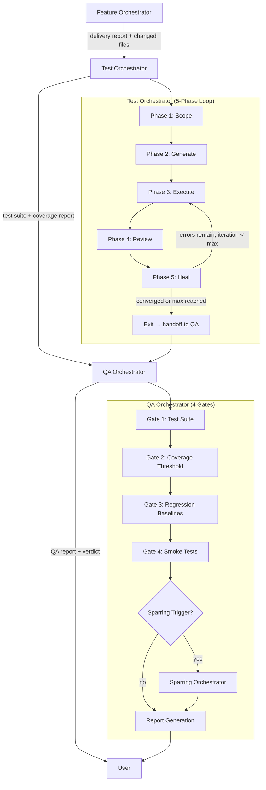
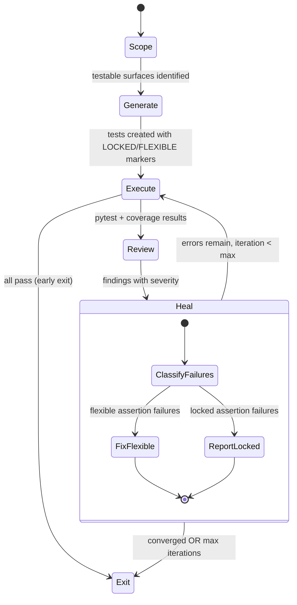
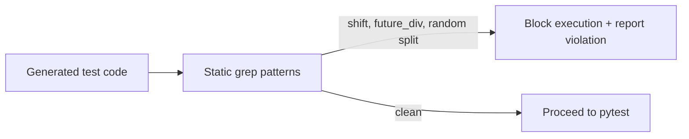
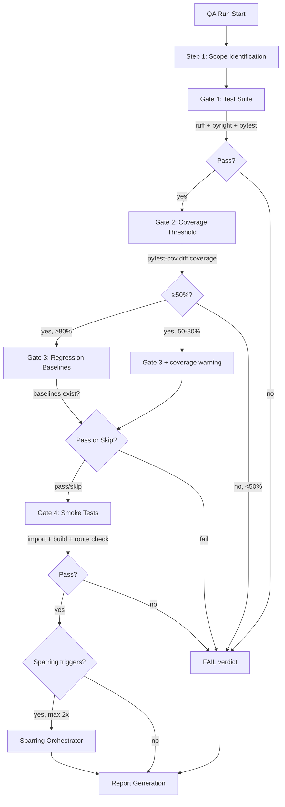
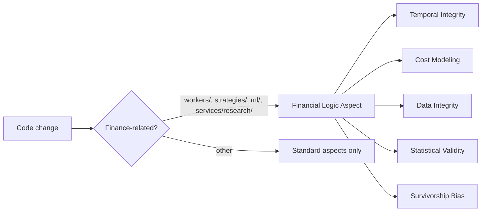

# Self-Healing Test Pipeline — Implementation Plan & Workflow

> **Status:** Implemented (AI Ecosystem artifacts created)
> **Date:** 2026-03-29
> **Scope:** AI Ecosystem v3 agent topology extension for automated test generation, self-healing, and quality certification

---

## 1. Overview

The test pipeline extends the existing feature delivery chain with two new orchestration stages:

```
feature-orchestrator → test-orchestrator → qa-orchestrator → [user]
```

Each orchestrator delegates execution to `software-engineer` and review to `code-reviewer`. The pipeline runs via VS Code Autopilot chaining — no external scripts or Ralph loops required.

**Goals:**

- Auto-generate tests for delivered features (including LLM-generated backtest code)
- Self-heal failing tests while preserving assertion integrity
- Enforce coverage thresholds and financial-domain quality gates
- Escalate design concerns to sparring-orchestrator when patterns indicate systemic issues

---

## 2. Pipeline Architecture



---

## 3. Test Orchestrator — Detail

### 3.1 Handoff Input

From `feature-orchestrator` Phase 10:

- Feature delivery report path
- Changed file list
- Acceptance criteria
- Affected test directories

### 3.2 Five-Phase Self-Healing Loop



### 3.3 Convergence Rules

| Rule                        | Threshold                                                              |
| --------------------------- | ---------------------------------------------------------------------- |
| Max iterations per batch    | 5                                                                      |
| Max iterations per function | 3                                                                      |
| Early stop                  | Iteration 3 with < 50% error reduction                                 |
| Thrashing detection         | Error count not monotonically decreasing over 2 consecutive iterations |

### 3.4 Assertion Immutability

Tests include marker comments to classify assertions:

```python
# LOCKED: acceptance-criteria-AC3 — must not be modified by self-healing
assert strategy.expectancy >= 0.005

# FLEXIBLE: mock-value — safe to adjust during healing
assert mock_api.call_count == 2
```

**Policy:** When classification is ambiguous, default to LOCKED (safer).

Full policy: `.github/context/assertion-policy.md`

### 3.5 Temporal Rules (Backtest Code)

For LLM-generated backtest tests, a static analysis pre-check runs before execution:



Blocked patterns: `shift(-`, `sample(frac=`, future dividend references, non-chronological splits.

Full rules: `.github/context/temporal-rules.md`

---

## 4. QA Orchestrator — Detail

### 4.1 Four-Gate Validation



### 4.2 Sparring Escalation Triggers

| Trigger                            | Evidence                 |
| ---------------------------------- | ------------------------ |
| >3 tests fail same module boundary | Interface design issue   |
| Contradictory smoke behavior       | Structural inconsistency |
| >50% changed lines uncovered       | Systematic coverage gap  |
| Regression drift in untouched area | Unintended side effect   |

**Budget:** Max 2 sparring consultations per QA run.
Sparring findings are tagged `needs-human-decision` in the QA report.

### 4.3 Verdict Rules

| Condition                      | Verdict                             |
| ------------------------------ | ----------------------------------- |
| All gates PASS, none skipped   | PASS                                |
| All gates PASS, some skipped   | PASS WITH CAVEATS                   |
| Coverage 50-80%, all else pass | PASS WITH CAVEATS                   |
| Any gate FAIL                  | FAIL                                |
| Sparring findings present      | Append `needs-human-decision` items |

---

## 5. Financial-Logic Review Aspect

New 8th aspect in the multi-aspect code review system. Triggers on research/finance code.



**Scope:** `divical-api/app/workers/**`, `divical-api/app/services/research/**`, `divical-api/app/strategies/**`, `divical-api/app/ml/**`

Full aspect definition: `.github/skills/multi-aspect-code-review/aspects/financial-logic.aspect.md`

---

## 6. Artifact Inventory

### New Files Created

| File                                                                        | Type          | Purpose                                            |
| --------------------------------------------------------------------------- | ------------- | -------------------------------------------------- |
| `.github/agents/test-orchestrator.agent.md`                                 | Agent         | Self-healing test generation orchestrator          |
| `.github/procedures/test-orchestration.procedure.md`                        | Procedure     | 5-phase self-healing lifecycle                     |
| `.github/context/assertion-policy.md`                                       | Context       | Locked vs flexible assertion classification        |
| `.github/context/temporal-rules.md`                                         | Context       | Look-ahead bias prevention for backtests           |
| `.github/skills/multi-aspect-code-review/aspects/financial-logic.aspect.md` | Aspect        | Financial domain review checklist                  |
| `.github/instructions/rbi-pipeline.instructions.md`                         | Instructions  | RBI domain context (auto-loaded for pipeline code) |
| `docs/architecture/test-pipeline-workflow.md`                               | Documentation | This document                                      |

### Files Modified

| File                                                          | Change                                                                   |
| ------------------------------------------------------------- | ------------------------------------------------------------------------ |
| `.github/agents/qa-orchestrator.agent.md`                     | Added Gate 2 (coverage), sparring escalation, updated worker roster      |
| `.github/procedures/qa-orchestration.procedure.md`            | Added coverage gate step, sparring escalation step, 4-gate verdict rules |
| `.github/agents/feature-orchestrator.agent.md`                | Added handoff protocol to test-orchestrator in Phase 10                  |
| `.github/skills/multi-aspect-code-review/aspects/_index.md`   | Added financial-logic aspect row                                         |
| `.github/skills/multi-aspect-code-review/SKILL.md`            | Added Financial Logic as domain #8                                       |
| `.github/instructions/multi-aspect-review.instructions.md`    | Added financial-logic aspect selection guidance                          |
| `.github/instructions/AI Ecosystem-authoring.instructions.md` | Added test-orchestrator to agent roster                                  |

### Dependencies

| Dependency   | Status    | Purpose                         |
| ------------ | --------- | ------------------------------- |
| `pytest-cov` | Installed | Coverage measurement for Gate 2 |

---

## 7. Usage

### Standalone Test Generation

```
@test-orchestrator Generate tests for the changes in <delivery-report-path>
```

### Standalone QA Certification

```
@qa-orchestrator Certify the changes described in <delivery-report-path>
```

### Full Pipeline (Autopilot)

After `@feature-orchestrator` completes Phase 10, it outputs:

```
**Next:** @test-orchestrator <delivery-report-path>
```

The test-orchestrator then outputs:

```
**Next:** @qa-orchestrator <test-report-path>
```

Each handoff includes: changed files, acceptance criteria, affected test directories, and reports from prior stages.
