# AI ecosystem Feature Delivery Pipeline: Research → Implementation

> **Last Updated:** April 7, 2026

## Overview

There are **two distinct "swarm" concepts** in this codebase:

1. **The RBI Research Pipeline** (automated, runs in `divical-api` via ARQ cron / GitHub Actions) — this is the "research swarm" that produces a consensus document.
2. **The AI ecosystem agent orchestration** (VS Code agents) — this is the sequence of orchestrators that turn research output into implemented, tested, reviewed code.

**Manual touch points:** Only **two** in the entire pipeline — reading the consensus document and reviewing the generated feature specification. Everything else runs autonomously.

---

## End-to-End Pipeline Diagram

```mermaid
flowchart TD
    classDef autonomous fill:#2d6a4f,stroke:#1b4332,color:#fff
    classDef manual fill:#e76f51,stroke:#9b2226,color:#fff
    classDef pause fill:#e9c46a,stroke:#f4a261,color:#000
    classDef orchestrator fill:#264653,stroke:#1d3557,color:#fff
    classDef agent fill:#457b9d,stroke:#1d3557,color:#fff
    classDef output fill:#a8dadc,stroke:#457b9d,color:#000

    %% ===== STAGE 0: Research Pipeline =====
    subgraph S0["STAGE 0 — Research Pipeline (Server-Side, Fully Autonomous)"]
        direction TB
        S0_trigger["⚡ Trigger: ARQ Cron (every 3 days)<br/>or POST /api/research/trigger"]:::autonomous
        S0_prompts["Stage 0: Prompt Loading<br/>prompt_loader.py → PipelinePrompts"]:::autonomous
        S0_consol["Stage 1: 2-Step Consolidation<br/>6 LLMs + Claude Opus 4.6 independently<br/>→ Claude 4.6 synthesizes all"]:::autonomous
        S0_feasib["Stage 2: Feasibility<br/>Tavily web search + Claude"]:::autonomous
        S0_swarm["Stage 3: Analyst Swarm + Consensus<br/>Per-analyst model routing<br/>→ Claude as 'senior research director'"]:::autonomous
        S0_extract["Stage 4: Proposal Extraction<br/>LLM → JSON → StrategyProposal rows"]:::autonomous
        S0_out1(["📄 consensus.md"]):::output
        S0_out2(["🗃️ StrategyProposal DB rows<br/>status=approved"]):::output

        S0_trigger --> S0_prompts --> S0_consol --> S0_feasib --> S0_swarm --> S0_extract
        S0_swarm --> S0_out1
        S0_extract --> S0_out2
    end

    %% ===== STAGE 1: Research-to-Spec Orchestrator (Autonomous Chain) =====
    subgraph S1["STAGE 1 — Research-to-Spec Orchestrator (Autonomous)"]
        direction TB
        S1_you["👤 YOU read consensus doc<br/>and trigger research-to-spec prompt"]:::manual

        S1_intake["Phase 1 — Intake<br/>Read consensus + codebase summary<br/>+ domain knowledge"]:::orchestrator

        S1_spar["🤖 sparring-orchestrator<br/>Multi-perspective analysis<br/>Creative approaches, risks,<br/>assumptions, feasibility"]:::agent

        S1_cr["🤖 code-reviewer<br/>Multi-aspect review of proposals<br/>Breaking changes, security, perf"]:::agent

        S1_se["🤖 software-engineer<br/>Produce ordered change list<br/>Test strategy, rollback plan"]:::agent
        S1_impl_out(["📄 implementation-plan-YYYY-MM-DD.md"]):::output

        S1_tp["🤖 thinking-partner<br/>Detailed plan: phases, deps,<br/>verification criteria, slicing"]:::agent

        S1_se2["🤖 software-engineer<br/>Generate feature specification<br/>from template + detailed plan"]:::agent
        S1_spec_out(["📄 feature-spec-YYYY-MM-DD.md"]):::output

        S1_review["👤 MANUAL REVIEW<br/>Approve / Revise / Stop"]:::manual
        S1_revision{{"⏸ Revision loop<br/>(max 3 cycles)"}}:::pause

        S1_you --> S1_intake --> S1_spar --> S1_cr --> S1_se --> S1_impl_out
        S1_impl_out --> S1_tp --> S1_se2 --> S1_spec_out --> S1_review
        S1_review -->|"Revise"| S1_revision
        S1_revision --> S1_se2
    end

    %% ===== STAGE 2: Feature Orchestrator =====
    subgraph S2["STAGE 2 — Feature Orchestrator (10 Phases)"]
        direction TB
        S2_invoke["⚙️ feature-orchestrator<br/>auto-invoked after spec approval"]:::autonomous

        S2_P1["Phase 1 — Intake<br/>Orchestrator reads spec<br/>Extracts scope & confidence"]:::orchestrator
        S2_P1_pause{{"⏸ Pause if<br/>confidence < 80%"}}:::pause

        S2_P2["Phase 2 — Plan<br/>🤖 thinking-partner<br/>Slice decomposition, risks, test strategy"]:::agent
        S2_P2_pause{{"⏸ Pause if unresolved<br/>question blocks slicing"}}:::pause

        S2_P3["Phase 3 — Select Slice<br/>Orchestrator picks next slice<br/>Defines brief & boundaries"]:::orchestrator
        S2_P3_pause{{"⏸ Pause after<br/>every 5 slices"}}:::pause

        S2_P4["Phase 4 — Implement<br/>🤖 software-engineer<br/>✋ You approve each file edit"]:::agent
        S2_P5["Phase 5 — Verify<br/>🤖 software-engineer<br/>ruff + pyright + pytest<br/>✋ You approve each command"]:::agent

        S2_P6["Phase 6 — Review<br/>🤖 code-reviewer<br/>Multi-aspect adversarial review<br/>Blocking vs non-blocking findings"]:::agent

        S2_P7["Phase 7 — Decide<br/>Orchestrator evaluates results"]:::orchestrator
        S2_P7_pause{{"⏸ Pause if needs-human-decision<br/>or spec drift detected"}}:::pause

        S2_P8["Phase 8 — Remediate<br/>🤖 software-engineer<br/>Surgical fixes for blockers only<br/>(max 3-5 iterations)"]:::agent

        S2_P9["Phase 9 — Post-Delivery Docs<br/>🤖 software-engineer (gated)<br/>Doc updates + AI ecosystem audit (detect only)<br/>Skipped if no evidence"]:::agent
        S2_P10["Phase 10 — Finalize<br/>Orchestrator confirms all slices done"]:::orchestrator
        S2_out(["📄 Feature Delivery Report"]):::output

        S2_invoke --> S2_P1
        S2_P1 --> S2_P1_pause
        S2_P1_pause -->|"OK"| S2_P2
        S2_P2 --> S2_P2_pause
        S2_P2_pause -->|"OK"| S2_P3
        S2_P3 --> S2_P3_pause
        S2_P3_pause -->|"OK"| S2_P4
        S2_P4 --> S2_P5
        S2_P5 -->|"fail"| S2_P4
        S2_P5 -->|"pass"| S2_P6
        S2_P6 --> S2_P7
        S2_P7 --> S2_P7_pause
        S2_P7_pause -->|"blocking findings"| S2_P8
        S2_P8 --> S2_P5
        S2_P7_pause -->|"all clear<br/>more slices"| S2_P3
        S2_P7_pause -->|"all clear<br/>no more slices"| S2_P9
        S2_P9 --> S2_P10
        S2_P10 --> S2_out
    end

    %% ===== STAGE 3: Test Orchestrator =====
    subgraph S3["STAGE 3 — Test Orchestrator (Self-Healing Loop)"]
        direction TB
        S3_invoke["⚙️ test-orchestrator<br/>auto-invoked after delivery"]:::autonomous
        S3_scope["Phase 1 — Scope<br/>Extract testable surfaces<br/>from delivery report"]:::orchestrator
        S3_gen["Phase 2 — Generate<br/>🤖 software-engineer<br/>Unit + integration + backtest tests<br/>✋ You approve edits"]:::agent
        S3_exec["Phase 3 — Execute<br/>🤖 software-engineer<br/>pytest + coverage<br/>✋ You approve commands"]:::agent
        S3_review["Phase 4 — Review<br/>🤖 code-reviewer<br/>Test correctness + financial-logic"]:::agent
        S3_heal["Phase 5 — Heal<br/>🤖 software-engineer<br/>Fix blocking findings<br/>(max 5 iterations)"]:::agent
        S3_out(["📄 Test Generation Report<br/>+ handoff block for QA"]):::output

        S3_invoke --> S3_scope --> S3_gen --> S3_exec
        S3_exec -->|"pass"| S3_review
        S3_review -->|"blocking"| S3_heal
        S3_heal --> S3_exec
        S3_review -->|"clear"| S3_out
    end

    %% ===== STAGE 4: QA Orchestrator =====
    subgraph S4["STAGE 4 — QA Orchestrator (4-Gate Validation + Auto-Remediation)"]
        direction TB
        S4_invoke["⚙️ qa-orchestrator<br/>auto-invoked after tests"]:::autonomous
        S4_G1["Gate 1: Test Suite<br/>ruff + pyright + pytest"]:::orchestrator
        S4_G2["Gate 2: Coverage<br/>Diff-coverage ≥ 50%<br/>Warn < 80%"]:::orchestrator
        S4_G3["Gate 3: Regression<br/>Baseline comparison<br/>(or SKIPPED if none)"]:::orchestrator
        S4_G4["Gate 4: Smoke<br/>Import check + config load<br/>+ route registration"]:::orchestrator
        S4_sparring{{"Sparring Escalation?<br/>>3 failures at boundary<br/>or systematic gaps"}}:::pause
        S4_spar["🤖 sparring-orchestrator<br/>Multi-perspective design analysis<br/>(max 2x per run)"]:::agent
        S4_report["📄 QA Report Generation"]:::orchestrator
        S4_remediate{{"Any gate FAIL?"}}:::pause
        S4_fix["🤖 software-engineer<br/>Fix gate failures<br/>(max 3 iterations)"]:::agent
        S4_rerun["Re-run failed gates only"]:::orchestrator
        S4_out(["📄 Final QA Report<br/>PASS / PASS WITH CAVEATS /<br/>PASS (REMEDIATED) / FAIL"]):::output

        S4_invoke --> S4_G1 --> S4_G2 --> S4_G3 --> S4_G4 --> S4_sparring
        S4_sparring -->|"triggered"| S4_spar --> S4_report
        S4_sparring -->|"not triggered"| S4_report
        S4_report --> S4_remediate
        S4_remediate -->|"yes"| S4_fix --> S4_rerun
        S4_rerun -->|"still failing, budget left"| S4_fix
        S4_rerun -->|"all pass or budget exhausted"| S4_out
        S4_remediate -->|"no"| S4_out
    end

    %% ===== INTER-STAGE CONNECTIONS =====
    S0_out1 --> S1_you
    S1_review -->|"Approve"| S2_invoke
    S2_out --> S3_invoke
    S3_out --> S4_invoke

    %% ===== LEGEND =====
    subgraph Legend
        direction LR
        L1["Autonomous"]:::autonomous
        L2["Manual / You"]:::manual
        L3["Pause Point"]:::pause
        L4["Orchestrator"]:::orchestrator
        L5["Worker Agent"]:::agent
        L6["Output"]:::output
    end
```

### Legend

| Color                 | Meaning                                       |
| --------------------- | --------------------------------------------- |
| 🟢 Green              | Fully autonomous — no human involved          |
| 🔴 Red/Orange         | Manual step — you act                         |
| 🟡 Yellow diamond     | Pause point — orchestrator stops and asks you |
| 🔵 Dark blue          | Orchestrator decision logic                   |
| 🔵 Medium blue        | Worker agent doing the actual work            |
| 🔵 Light blue rounded | Output artifact passed to the next stage      |

---

## Stage-by-Stage Breakdown

### Stage 0 — Research Pipeline (Fully Autonomous)

Runs entirely server-side. Triggered by `POST /api/research/trigger` or ARQ cron every 3 days.

| Sub-stage                     | What happens                                                                                                                                                                                                 | Output                                                 |
| ----------------------------- | ------------------------------------------------------------------------------------------------------------------------------------------------------------------------------------------------------------ | ------------------------------------------------------ |
| **Prompt loading**            | Reads `prompts/research.md`, `feasibility.md`, `consensus.md`, + auto-discovers `prompts/analysts/*.md`                                                                                                      | `PipelinePrompts` object                               |
| **2-step consolidation**      | Concurrent calls to 6 LLMs (GPT-5.4, DeepSeek-v3.2, Gemini-3.1-pro-preview, Minimax-m2.7, Qwen3.6-plus, Claude Opus 4.6) + Claude Opus 4.6 independently, then Claude 4.6 synthesizes all                    | `research-output/research-{ts}/research/research.md`   |
| **Feasibility**               | Tavily web search + feasibility prompt → Claude Opus                                                                                                                                                         | `research-output/research-{ts}/enhanced/enhanced.md`   |
| **Analyst swarm + consensus** | Per-analyst model routing (strategy→Gemini-3.1-pro-preview, risk→Claude Opus, feasibility→GPT-5.4) run in parallel, assembled into findings, then Claude as "senior research director" synthesizes consensus | `research-output/research-{ts}/consensus/consensus.md` |
| **Proposal extraction**       | GLM-5 extracts JSON array of `StrategyProposal` rows from consensus                                                                                                                                          | DB rows with `status="approved"`                       |

**Output:** A consensus document (`consensus.md`) and approved `StrategyProposal` database records.

---

### Stage 1 — Research-to-Spec Orchestrator (Autonomous Chain)

You read the consensus document and invoke the `research-to-spec.orchestrate.prompt`. From here, the **research-orchestrator** runs 7 phases autonomously, pausing only for the mandatory manual review of the generated specification.

| Phase | Name                    | Who runs it                                 | What gets passed IN                                 | What comes OUT                                                                       | Autonomous?                                                                                                                                     |
| ----- | ----------------------- | ------------------------------------------- | --------------------------------------------------- | ------------------------------------------------------------------------------------ | ----------------------------------------------------------------------------------------------------------------------------------------------- |
| **1** | Intake                  | Orchestrator                                | Consensus doc path (or "latest")                    | Consensus highlights, recommendation count, scope assessment                         | **Autonomous** — stops only if no consensus found or no actionable recommendations                                                              |
| **2** | Analyze                 | `sparring-orchestrator`                     | Consensus + codebase summary + domain knowledge     | Multi-perspective synthesis: creative approaches, risks, assumptions, feasibility    | **Autonomous** — sparring-orchestrator runs its hidden partners (architecture, implementation, operations, creative, devils-advocate, thinking) |
| **3** | Review                  | `code-reviewer`                             | Consensus + sparring analysis                       | Normalized findings: breaking changes, security, performance, pattern conflicts      | **Autonomous**                                                                                                                                  |
| **4** | Plan (Impl)             | `software-engineer`                         | Consensus + analysis + review findings              | `implementation-plan-YYYY-MM-DD.md`: ordered changes, test strategy, rollback        | **Autonomous**                                                                                                                                  |
| **5** | Plan (Detail) + Specify | `thinking-partner` then `software-engineer` | Implementation plan → detailed plan → spec template | Detailed execution plan with phases/deps/verification → `feature-spec-YYYY-MM-DD.md` | **Autonomous**                                                                                                                                  |
| **6** | Manual Review           | **YOU**                                     | Generated feature specification                     | Approve / Revise / Stop                                                              | **⏸ PAUSE — mandatory manual gate**                                                                                                             |
| **7** | Handoff                 | Orchestrator                                | Approved spec path                                  | Structured handoff to feature-orchestrator                                           | **Autonomous**                                                                                                                                  |

**Spec revision loop:** If you select "Revise" during manual review, you provide feedback and the orchestrator re-invokes software-engineer to update the spec, then presents it again. Maximum 3 revision cycles.

**Output:** Approved feature specification + implementation plan. Feature-orchestrator is auto-invoked.

---

### Stage 2 — Feature Orchestrator (Mostly Autonomous — Pauses at Defined Points)

After you approve the feature spec, the feature-orchestrator is invoked automatically. It runs autonomously through 10 phases:

| Phase  | Name               | Who runs it                 | What gets passed IN                                     | What comes OUT                                                          | Autonomous?                                                                                                                                                            |
| ------ | ------------------ | --------------------------- | ------------------------------------------------------- | ----------------------------------------------------------------------- | ---------------------------------------------------------------------------------------------------------------------------------------------------------------------- |
| **1**  | Intake             | Orchestrator                | Feature spec file/description                           | Goal statement, scope summary, confidence                               | **Autonomous** unless spec is too vague (confidence < 80%) → **pauses, asks you**                                                                                      |
| **2**  | Plan               | `thinking-partner`          | Feature spec + acceptance criteria                      | Slice plan, dependencies, risks, test strategy                          | **Autonomous** unless unresolved question blocks slice definition → **pauses, asks you**                                                                               |
| **3**  | Select Slice       | Orchestrator                | Slice plan                                              | Slice brief (objective, files, acceptance criteria, verification scope) | **Autonomous** — but **pauses after every 5 slices** and asks you to continue                                                                                          |
| **4**  | Implement          | `software-engineer`         | Slice brief with scope boundaries                       | Implementation summary, changed files                                   | **Autonomous** (but in non-autopilot mode: **you must accept each file edit** in the VS Code diff view)                                                                |
| **5**  | Verify             | `software-engineer`         | Verification commands                                   | Pass/fail per lint/types/tests                                          | **Autonomous** (but in non-autopilot: **you must approve each terminal command**)                                                                                      |
| **6**  | Review             | `code-reviewer`             | Current diff                                            | Normalized findings (blocking / non-blocking)                           | **Autonomous**                                                                                                                                                         |
| **7**  | Decide             | Orchestrator                | Verification results + review findings + spec alignment | Decision: next slice / remediate / stop                                 | **Autonomous** unless: `needs-human-decision` finding → **pauses, asks you**; spec drift detected → **pauses, asks you**; sub-agent error → **pauses, reports to you** |
| **8**  | Remediate          | `software-engineer`         | Only blocking findings + current diff                   | Surgical fixes, then back to Verify (Phase 5)                           | **Autonomous** (same file-edit/terminal approval as Phase 4/5). Max 3-5 iterations per slice — if convergence fails → **stops and reports**                            |
| **9**  | Post-Delivery Docs | `software-engineer` (gated) | Evidence of doc/API/schema changes                      | Doc updates, AI ecosystem audit list                                    | **Autonomous** — skipped entirely if no evidence triggers it. AI ecosystem audit is detection-only (reports stale artifacts, doesn't fix them)                         |
| **10** | Finalize           | Orchestrator                | All slice results                                       | Feature delivery report                                                 | **Autonomous**                                                                                                                                                         |

> **Non-autopilot note:** The orchestration logic is autonomous (it decides what to do next without asking you). But because you're not using autopilot, VS Code will prompt you to approve every file edit (diff view) and every terminal command (allow/deny).

> **Session state persistence:** At Phase 1 (Intake), the feature-orchestrator writes a workflow state file to `.github/runtime/feature-state/{workflow_id}.state.json`. This file is updated after each phase transition. If a session is interrupted, the orchestrator reads the state file on the next invocation and **resumes from `current_phase`** — skipping completed phases. It validates that the `branch` field matches the current git branch before resuming.

**Output:** Feature Delivery Report

---

### Stage 3 — Test Orchestrator (Self-Healing Loop)

After the feature orchestrator produces its delivery report, the test orchestrator is auto-invoked with the delivery report path.

| Phase | Name     | Who                    | What gets passed IN                                  | What comes OUT                                          | Autonomous?                                                                                                            |
| ----- | -------- | ---------------------- | ---------------------------------------------------- | ------------------------------------------------------- | ---------------------------------------------------------------------------------------------------------------------- |
| **1** | Scope    | Orchestrator + Explore | Delivery report (changed files, acceptance criteria) | Testable surfaces, test types needed, locked assertions | **Autonomous**                                                                                                         |
| **2** | Generate | `software-engineer`    | Scope brief + source code + existing test patterns   | Test files (unit, integration, backtest)                | **Autonomous** (you approve file edits)                                                                                |
| **3** | Execute  | `software-engineer`    | Test files                                           | Pass/fail, coverage delta                               | **Autonomous** (you approve terminal commands)                                                                         |
| **4** | Review   | `code-reviewer`        | Generated test code                                  | Review findings (blocking/non-blocking)                 | **Autonomous**                                                                                                         |
| **5** | Heal     | `software-engineer`    | Only blocking findings + failing tests               | Fixes → back to Execute                                 | **Autonomous**, bounded: max 5 iterations per batch, max 3 per individual test. Stops if thrashing or plateau detected |

**Output:** Test generation report + handoff block for QA orchestrator.

---

### Stage 4 — QA Orchestrator (4-Gate Validation + Auto-Remediation)

Auto-invoked after the test orchestrator. Runs 4 quality gates sequentially — **all gates run regardless of failures**. If any gate fails, the QA orchestrator delegates fixes to `software-engineer` and re-runs failed gates (max 3 iterations).

| Gate              | What                                          | Threshold                                        | Autonomous?                           |
| ----------------- | --------------------------------------------- | ------------------------------------------------ | ------------------------------------- |
| **1: Test Suite** | `ruff check` + `pyright` + `pytest`           | All exit 0                                       | **Autonomous** (you approve commands) |
| **2: Coverage**   | Diff-coverage of changed lines                | Fail < 50%, Warn < 80%                           | **Autonomous**                        |
| **3: Regression** | Run regression tests against stored baselines | All pass (or gracefully SKIPPED if no baselines) | **Autonomous**                        |
| **4: Smoke**      | Import check, config load, route registration | All exit 0                                       | **Autonomous**                        |

After all 4 gates, it evaluates whether a **sparring escalation** is warranted (e.g., >3 tests fail at same module boundary, systematic coverage gaps). If triggered, it invokes `sparring-orchestrator` (max 2x) for multi-perspective design analysis.

**Auto-remediation:** If any gate failed, the QA orchestrator generates an initial report, then enters a remediation loop:

1. Identifies the specific failures from the report
2. Delegates fixes to `software-engineer` (e.g., `ruff check --fix` for lint, manual fixes for type/test errors)
3. Re-runs **only the failed gates**
4. Loops until all gates pass or budget exhausted (max 3 iterations)

**Remediation exclusions:** Coverage warnings (50-80%) are non-blocking and do not trigger remediation. Sparring findings flagged as `needs-human-decision` require user review. Failures requiring architectural changes are escalated.

**Output:** Final QA report with per-gate results, remediation log (if applicable), and overall verdict.

| Verdict                        | Condition                                              |
| ------------------------------ | ------------------------------------------------------ |
| PASS                           | All gates pass, none skipped                           |
| PASS WITH CAVEATS              | All gates pass with skips or coverage warnings         |
| PASS (REMEDIATED)              | All gates pass after auto-remediation                  |
| PASS WITH CAVEATS (REMEDIATED) | All gates pass after remediation with warnings/skips   |
| FAIL                           | Gates still failing after remediation budget exhausted |

---

## Your Manual Touch Points (Non-Autopilot Mode)

Only **two** mandatory manual steps in the entire pipeline:

| Step                             | What you do                                                                    |
| -------------------------------- | ------------------------------------------------------------------------------ |
| **After research pipeline runs** | Read the consensus document and trigger the research-to-spec prompt            |
| **Review feature specification** | Review and approve the generated feature spec before the orchestrator delivers |

During execution (non-autopilot VS Code), you will also be prompted to:

| Interaction                 | What happens                                                                                                                         |
| --------------------------- | ------------------------------------------------------------------------------------------------------------------------------------ |
| **During feature delivery** | Accept/reject each file edit diff, allow/deny each terminal command                                                                  |
| **If orchestrator pauses**  | Answer clarifying questions, approve human-decision items                                                                            |
| **During test generation**  | Same accept/reject for edits and commands                                                                                            |
| **After QA report**         | Review verdict; auto-remediation handles most failures, but `needs-human-decision` items and architectural issues require your input |
