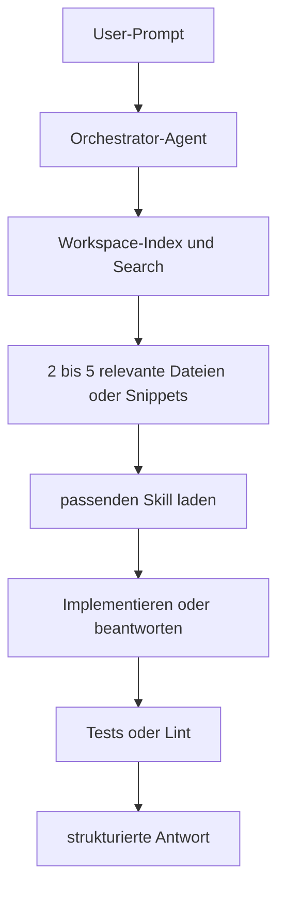
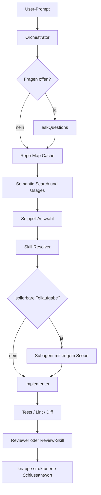
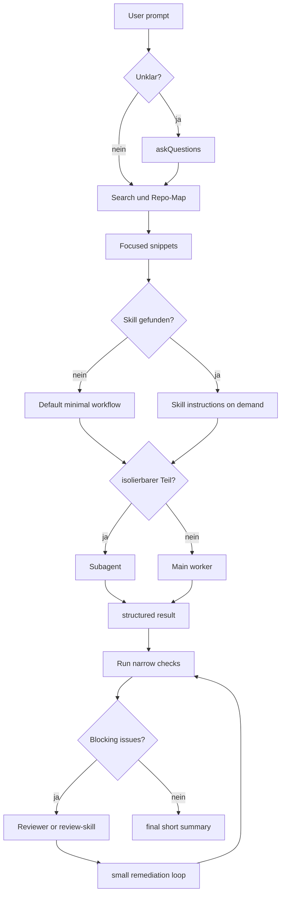

# Kontextminimierung und Tokenkompression für einen VS Code Copilot Harness

## Kurzfazit

Dein Grundgedanke ist **im Kern gut**, aber nur in einer bestimmten Ausprägung: **ein sichtbarer Orchestrator, ein bis zwei spezialisierte Worker, viele on-demand geladene Skills, minimale dauerhafte Instructions**. Genau diese Richtung passt am besten zu dem, was VS Code und GitHub Copilot inzwischen selbst dokumentieren: Der eigentliche Hebel ist nicht „mehr Agenten“, sondern der **Harness** – also Kontextaufbau, Tool-Auswahl, Agent-Loop, Speicher, Auswertung, Sicherheitsgrenzen und Prompt-Budgetierung. VS Code beschreibt den Harness explizit als die Schicht, die Kontext zusammenstellt, Tools exponiert, den Agent-Loop fährt und Tool-Ergebnisse zurück in den nächsten Schritt einspeist. citeturn42view0

Die schlechte Variante deiner Idee wäre dagegen: **am Anfang alles laden**, große statische Repo-Dateien ungefiltert reinwerfen, jeden Task sofort in Subagents zerlegen und Ergebnisse wieder in langen Fließtext zurückreichen. Das ist weder token-effizient noch wartbar. VS Code dokumentiert Skills ausdrücklich als **relevanzbasiert und on-demand geladen**, während Custom Instructions eher dauerhaft gelten. Gleichzeitig zeigen neuere Forschungen zu `AGENTS.md`-artigen Repo-Kontextdateien, dass unnötige oder zu ausführliche Kontextdateien die Erfolgsrate eher senken und die Inferenzkosten um mehr als 20 % erhöhen können. citeturn45view0turn45view1turn37search0turn37search14

Für deinen Anwendungsfall ist deshalb die beste Zielarchitektur nicht „maximal agentisch“, sondern **minimal sichtbar, maximal komponierbar**:  
ein Orchestrator mit klarer Delegationslogik, **Skills statt Agent-Sprawl**, **progressive Kontextladung**, **strukturierte schmale Rückgaben**, **Diffs statt Volltexte**, **konsequente Verifikation**, **Subagents nur bei wirklich unabhängigen Teilaufgaben**. Die VS-Code-Dokumentation zu Subagents stützt genau diese Sicht: Sie sind dann stark, wenn man Forschung, Codeanalyse oder Reviews **kontextisoliert** und teilweise **parallel** ausführen kann; der Default ist aber nicht „immer Subagent“, sondern „wenn Isolation hilft“. citeturn44view0turn43view0

Der wichtigste Punkt zur Kompression: **Caveman-artige Output-Kompression ist nicht dasselbe wie „max output tokens = 5000“**. Ein Token-Limit begrenzt nur die Antwortlänge. Caveman-artige Verfahren sparen Tokens, weil sie entweder **den Antwortstil aktiv verdichten** oder **Kontext vor dem Hauptmodell umschreiben bzw. filtern**. Moderne Forschungsansätze wie LLMLingua, LongLLMLingua, LLMLingua-2 und LongCodeZip gehen noch weiter und komprimieren **den Eingabekontext vor der eigentlichen Modellanfrage**. citeturn28view1turn35view0turn13search8turn12search1turn13search0turn14search0

Meine klare Empfehlung für dich ist daher: **der balancierte Aufbau**. Nicht der nackte Minimalmodus, aber auch nicht die aggressive Forschungsvariante. Für DiviCal wäre das voraussichtlich: **ein Orchestrator, ein Implementer, ein Reviewer/Researcher, 6–12 Skills, kleine path-spezifische Instructions, symbolische Repo-Map, strukturierte Skill-Outputs, Diffs statt Volltext, optional lokaler Sidecar oder MCP nur für Repo-Metadaten und stabile Retrieval-Hilfen**. citeturn42view0turn45view0turn44view0turn18search0

## Was sich über DiviCal verifizieren lässt

Eine harte Grenze vorweg: **`4sthea/Divical` war in den öffentlich zugänglichen GitHub-Daten dieser Recherche nicht direkt verifizierbar**. Öffentlich sichtbar war das Konto `4sthea`, und dort wurde genau **ein öffentliches Repository** angezeigt: `public`. Dieses Repo enthält offenkundig AI-/Agenten- und Tokeneffizienz-Notizen, aber nicht verifizierbar die DiviCal-Anwendung selbst. Deshalb markiere ich alles DiviCal-Spezifische, was nicht direkt aus öffentlichen GitHub-Daten folgt, als **unverifiziert**. citeturn20view0turn21view0turn22view0

### Öffentlich verifizierbarer GitHub-Stand

| Artefakt | Beobachtung | Bedeutung für diese Analyse |
|---|---|---|
| GitHub-Konto `4sthea` | Öffentlich sichtbar als GitHub-Account „Asthea / 4sthea“. citeturn20view0 | Konto existiert öffentlich. |
| Öffentliche Repositories | GitHub zeigte öffentlich **1 Repository**. citeturn21view0 | `Divical` war öffentlich nicht sichtbar. |
| Öffentliches Repo `4sthea/public` | Repo `public`, Sprache Python, letzter sichtbarer Update-Zeitpunkt: 26. Mai 2026. citeturn22view0 | Für DiviCal nur indirekt relevant; enthält aber offenbar deine AI-/Harness-Notizen. |
| `public/march-2026/` | Enthält u. a. `feature-delivery-orchestrator.md`, `agent-orchestration.md`, `compression/`, `thinking-patterns.md`. citeturn24view1 | Zeigt, dass du das Orchestrator-/Skills-Thema bereits systematisch zerlegst. |
| `public/march-2026/feature-delivery-orchestrator.md` | 1194 Zeilen, 32.4 KB; spezifiziert einen „Feature Delivery Orchestrator“ für VS Code + GitHub Copilot. citeturn47view0 | Starker Hinweis, dass die von dir beschriebene Architektur bereits konzeptionell vorbereitet ist. |
| `public/may-2026/token-effizienz.md` | 147 Zeilen, 24.7 KB; behandelt ausdrücklich Agent Harnesses, Tokeneffizienz und skills-zentrierte Architektur. citeturn24view0turn26view0 | Zeigt thematische Kontinuität, ersetzt aber keine direkte DiviCal-Codeanalyse. |

### Repo-Map-Vorlage für DiviCal

Da DiviCal öffentlich nicht verifizierbar war, ist die folgende Tabelle **keine Tatsachenbehauptung**, sondern eine **Arbeitsvorlage**, die ich für ein kleines bis mittleres VS-Code-/Copilot-Repo mit möglichem `clasp`-/Apps-Script-Einschlag wählen würde. Dass `appsscript.json` in Apps-Script-Projekten eine zentrale Rolle spielt, ist offiziell dokumentiert. citeturn19search2

| Pfad | Vermuteter Zweck | Vermutete Größe | Typische Relevanz |
|---|---|---:|---|
| `.github/copilot-instructions.md` | minimale repo-weite Regeln | klein | hoch für stilistische und prozedurale Standards |
| `.github/instructions/**` | pfadspezifische Regeln | klein bis mittel | hoch für gezielte Kontexte |
| `.github/skills/**/SKILL.md` | wiederverwendbare Workflows | klein bis mittel | sehr hoch, wenn Skills deinen Prozess tragen |
| `appsscript.json` | Apps-Script-Manifest | klein | sehr hoch, falls DiviCal tatsächlich Apps Script ist |
| `src/**` oder `server/**` | Kernlogik | mittel bis groß | sehr hoch |
| `tests/**` | Verifikation | mittel | sehr hoch für Implementierung und Review |
| `.github/workflows/**` | CI | klein bis mittel | hoch für sichere Änderungen |
| `docs/**` / `plans/**` | Architektur, Entscheidungsprotokolle | klein bis mittel | mittel bis hoch, aber nur selektiv laden |
| `generated/**`, `dist/**`, `coverage/**` | ableitbare Artefakte | groß | meist **ausschließen** |

Wenn DiviCal ein **kleines Repo** ist, reicht oft der eingebaute Workspace-Index plus 2–5 gezielt gelesene Dateien. Bei **mittleren Repos** brauchst du zusätzlich eine kleine symbolische Repo-Map und strukturierte Rückgaben. Bei **großen Repos** wird Hybrid-Retrieval oder wenigstens ein lokaler Symbol-/Chunk-Index fast unvermeidlich. VS Code selbst beschreibt für große Codebasen genau dieses Suchmuster: semantische Suche, Grep, Usages, File Search und iteratives Nachfassen statt „alles in den Prompt laden“. citeturn18search0turn46view3

## Wie du den Kontext in VS Code klein hältst

VS Code baut jeden Modellaufruf aus mehreren Schichten zusammen: Systemanweisungen, Customizations, User Message, Verlauf, impliziter Kontext, explizite Referenzen und Tool-Outputs. Für die Tokeneffizienz heißt das brutal einfach: **du musst nicht nur deine Nutzdateien minimieren, sondern auch Verlauf, Instructions, Memory und Tool-Rückgaben**. Gleichzeitig kann VS Code einen **Remote-, Local- oder Basic-Index** verwenden, damit semantische Suche und Code-Navigation nicht aus Volltext-Dumps bestehen müssen. citeturn46view3turn18search0

### Techniken zur Kontextminimierung

Die Tabelle unten kombiniert dokumentierte Funktionsweisen mit meiner Einschätzung zu Kosten und Eignung. **Tokenkostenmodell, Aufwand und Eignung sind meine Synthese**, nicht wörtliche Aussagen der Quellen.

| Technik | Wie sie funktioniert | Tokenkostenmodell | Implementierungsaufwand | Vorteile | Nachteile | Eignung für DiviCal |
|---|---|---|---|---|---|---|
| Eingebauter Workspace-Index | VS Code nutzt semantische Suche, Textsuche, Grep, Usages und File Search; bei GitHub-Repos kann ein Remote-Index genutzt werden. citeturn18search0turn46view3 | Sehr gut bei Suchphasen; schlecht nur, wenn du danach doch ganze Dateien indisziplinert lädst | niedrig | Sofort verfügbar, keine eigene Infra | Weniger kontrollierbar als eigene Pipeline | **sehr hoch** |
| Kleine path-spezifische Instructions | Repo-weite oder pfadspezifische Instruktionen statt eines riesigen globalen Dokuments. GitHub unterstützt repo-weite und pfadspezifische Instructions. citeturn17search1turn17search7 | Sehr günstig, solange kurz | niedrig | Gute Präzision bei Standards | Große Dateien werden teuer und können schaden | **hoch** |
| Agent Skills | Skills sind Ordner mit Instructions, Scripts und Ressourcen, die nur geladen werden, wenn relevant. citeturn45view0turn45view1turn11search0 | Sehr gut, weil on-demand | niedrig bis mittel | Wiederverwendbar, portabel, wartbar | Triggering muss sauber designt sein | **sehr hoch** |
| Lokales Memory-File | VS Code speichert lokales Memory nach Scope; User-/Repo-/Session-Memory haben unterschiedliche Persistenz. citeturn46view2 | Gut, wenn nur stabile Fakten persistiert werden | niedrig | Spart Wiederholungen über Sessions | Falsche oder stale Memory-Einträge schaden | **hoch** |
| Copilot Memory | GitHub-hosted Repo-Memory für mehrere Copilot-Oberflächen. citeturn46view2 | Gut für wiederkehrende Standards | niedrig bis mittel | Geteilte Repo-Erinnerung | Nicht alles sollte dauerhaft gelernt werden | **mittel bis hoch** |
| Temp-Dateien in `storageUri`/`globalStorageUri` | VS Code-Extensions können lokale Workspace- oder globale Storage-Verzeichnisse für große Hilfsartefakte nutzen. citeturn46view1 | Sehr gut, wenn du den LLM nur Knappfassungen laden lässt | mittel | Ideal für Repo-Map, Cache, Ranking-Ergebnisse | Zusätzliche Erweiterungslogik nötig | **hoch** |
| In-Memory-/Virtual Docs | VS Code erlaubt virtuelle, read-only Dokumente aus beliebigen Quellen. citeturn9search3 | Gut für temporäre, fokussierte Sichten | mittel | Kein Repo-Müll, gute UX | Ohne Budgetlogik bringen sie wenig | **mittel bis hoch** |
| Diffs/Patches statt Volltext | Der VS-Code-Harness exponiert Edit-Werkzeuge wie `apply_patch`; der Agent muss nicht ganze Dateien zurückschicken. citeturn42view0 | Exzellent für Rückgaben | niedrig bis mittel | Riesiger Output-Gewinn | Für Analyse allein nicht ausreichend | **sehr hoch** |
| Symbolische Repo-Map | Aider beschreibt eine kompakte Repo-Map mit wichtigsten Klassen/Funktionen und Signaturen. citeturn14search1 | Sehr gut, wenn symbolisch statt volltextlich | mittel | Ideal als Zwischenebene zwischen Index und Volltext | Braucht Regeneration und Ranking | **sehr hoch** |
| Embeddings + Hybrid Retrieval | Vektor- und Sparse-/BM25-Suche können kombiniert werden; reranking verbessert Relevanz. citeturn15search3turn41search0turn41search2turn41search13 | Sehr gut bei mittleren/großen Repos | mittel bis hoch | Gut für domänenspezifische Fragen und symbolarme Texte | Mehr Infra, mehr Staleness-Risiko | **mittel** für klein, **hoch** für groß |
| Selektive Summarisierung / `/compact` | VS Code kompaktifiziert lange Sessions automatisch; `/compact` geht auch manuell. citeturn38search1turn38search6turn38search9 | Gut für Verlauf, nicht für Codebasis selbst | niedrig | Hält Sessions nutzbar | Schlechte Zusammenfassungen verlieren Details | **hoch** |
| Prompt-Budgetierung per `prompt-tsx` | Prioritäten, Pruning und `flexGrow`/`flexReserve` für Extensions. citeturn46view0 | Sehr gut bei eigener Extension/Harness | mittel | Explizite Tokenkontrolle | Nur relevant, wenn du eigene Extensionlogik baust | **hoch**, falls du selbst baust |

Die wichtigste praktische Konsequenz daraus ist: **Kontext nie als monolithischen Block behandeln**.  
Die günstigste Reihenfolge ist fast immer:

1. **Frage klären, falls nötig**  
2. **Index / Search**  
3. **Repo-Map / Symbolsicht**  
4. **Snippet-Level Kontext**  
5. **Nur dann Volltext**  
6. **Nur dann Subagent**  
7. **Nur dann breite Verifikation**  
8. **Dann kurze strukturierte Rückgabe**

Das ist genau die Art progressiver Kontextassemblierung, die der VS-Code-Harness selbst nahelegt. citeturn42view0turn18search0turn46view3

### Was ich für deinen Copilot-Harness konkret tun würde

Ich würde in VS Code **nicht** als Erstes einen lokalen MCP-Server bauen. Ein lokaler MCP-Server ist gut, wenn du **stabile zusätzliche Tools** brauchst – etwa einen Repo-Symbolgraphen, eine Test-/CI-Abstraktion, einen Query-Service für lokale Indizes oder kontrollierte externe Systeme. Dafür ist MCP gedacht. Aber wenn dein Ziel zunächst nur **weniger Tokens** und **mehr Wartbarkeit** ist, kommst du oft weiter mit **bordmittelsicherem Kontextdesign**: eingebauter Workspace-Index, kleine path-spezifische Instructions, repo-lokale Skills, lokales Memory, Temp-Artefakte in `storageUri`, virtuelle fokussierte Dokumente und ein eigener kleiner Repo-Map-Cache. MCP ist der nächste Schritt, nicht der erste. citeturn16search1turn17search2turn17search11turn46view1turn46view2

Für eine selbstgebaute VS-Code-Erweiterung ist `@vscode/prompt-tsx` besonders wertvoll, weil du damit **Promptteile priorisieren und budgetieren** kannst. Das ist für deinen Use Case fast wichtiger als jede exotische Kompression, weil du damit systematisch verhindern kannst, dass etwa alter Chatverlauf wichtiger wird als die 60 Zeilen um den echten Hotspot. citeturn46view0

## Was Kompression wirklich bedeutet

Der Begriff „Kompression“ wird in Agent-Setups oft unscharf benutzt. Für deinen Fall sind es in Wahrheit **fünf verschiedene Dinge**.

### Verdichteter Ausgabestil

Das einfachste ist **Antwortstil-Kompression**. Das Caveman-Skill reduziert Output, indem es dem Modell eine sehr knappe Sprechweise vorschreibt: Artikel, Füllwörter, Hedging und Höflichkeitsformeln weg; technische Begriffe bleiben exakt; Code bleibt unverändert. Das ist kein versteckter Codec und kein zweiter Kanal, sondern schlicht bewusst knappes Antworten. citeturn28view1

Das bedeutet auch: **Nein, Caveman funktioniert nicht primär dadurch, dass irgendwo „max. 5000 Tokens“ angehängt wird.** Ein solches Limit kann zusätzliche Ausuferung verhindern, aber die eigentliche Ersparnis entsteht hier durch **andere Oberflächenform** der Antwort. Caveman spart Output-Tokens, weil dieselbe Bedeutung mit weniger sprachlichem Material formuliert wird. citeturn28view0turn28view1

### Vorverarbeitung des Kontexts durch Umschreiben

`caveman-compression` geht einen Schritt weiter. Das Repo beschreibt „lossless semantic compression“ als Entfernen **vorhersagbarer Grammatik**, während Fakten, Zahlen, Namen, technische Begriffe und constraints erhalten bleiben. Es bietet dafür drei Modi:  
ein **LLM-basiertes** Umschreiben, ein **MLM-basiertes** Verfahren mit RoBERTa, das hoch vorhersagbare Tokens entfernt, und ein **regel-/NLP-basiertes** Verfahren, das z. B. Stopwörter, Determiner und Hilfsverben entfernt. citeturn31view1turn31view2turn33view3turn33view5turn30view1turn30view3turn35view0

Wichtig daran: Auch das ist **keine magische Kompression im Modell**, sondern **Preprocessing**. Entweder schickst du die bereits verdichtete Fassung an das Hauptmodell, oder du nutzt die verdichtete Form direkt als RAG-/Arbeitskontext. Das Repo behauptet sogar explizit, dass Agenten oder RAG-Systeme die caveman-artige Form **ohne Dekompression** verstehen können. Das kann funktionieren – aber für Code würde ich das nur begrenzt einsetzen, weil syntaktische und relationale Details schneller leiden als bei normalem Prosa-Kontext. citeturn31view1turn31view2

### Gelerntes Prompt-Compression vor dem Hauptmodell

Die wissenschaftlich robustere Linie läuft über **LLMLingua**, **LongLLMLingua** und **LLMLingua-2**. Diese Verfahren komprimieren Prompts **vor** dem eigentlichen Modellaufruf, typischerweise mit einem kleineren Modell oder einem trainierten Token-Klassifikator. LLMLingua arbeitet grob gesagt über Budget Controller und iterative Token-Kompression; LongLLMLingua ist für Long-Context-Szenarien optimiert; LLMLingua-2 formuliert die Aufgabe als Token-Klassifikation und ist laut Autoren 3–6× schneller als frühere Varianten. citeturn13search8turn12search1turn13search0turn13search4

Das ist für dich deutlich relevanter als ein bloßer „sei kurz“-Prompt, wenn du wirklich den **Eingabekontext** drücken willst. Der Haken: Diese Verfahren sind stärker auf **natürliche Sprache** zugeschnitten als auf Quellcode; bei Code können sie helfen, aber sie sind nicht mein erster Hebel für einen Copilot-Harness. citeturn14search0turn40search1

### Code-spezifische Kompression

Für Code ist **LongCodeZip** interessanter. Das Papier beschreibt eine **zweistufige, code-spezifische** Kompression:  
zuerst grobes Function-Level-Ranking gegen die Anfrage, danach feinere Blockauswahl innerhalb der behaltenen Funktionen. Laut Autoren erreicht das System bis zu **5.6× Kompression ohne Performanceverlust** in den getesteten Aufgaben. citeturn14search0turn40search1

Für DiviCal bedeutet das: Wenn du wirklich mit **langen Codekontexten** kämpfst, ist LongCodeZip konzeptionell näher an deinem Problem als Caveman-Prosa. Der Preis ist aber höher: mehr Vorverarbeitung, mehr Komplexität, mehr eigene Pipeline. Für ein kleines bis mittleres Repo würde ich zuerst **repo map + Suche + Snippet-Selektion + Diff-only Outputs** bauen und erst dann Code-Kompression ergänzen. citeturn14search0turn18search0turn42view0

### Caching statt Kompression

Prompt Caching ist noch einmal etwas anderes. OpenAI beschreibt Prompt Caching als automatische Wiederverwendung jüngst verarbeiteter Prompt-Präfixe, was Kosten und Latenz senken kann; Anthropic dokumentiert automatische oder explizite Cache-Breakpoints. Das **verkürzt den Prompt nicht**, kann aber wiederholte lange Präfixe deutlich billiger machen. citeturn36search2turn36search1

Für deinen Copilot-Harness heißt das:  
Wenn du **wiederholt dieselben globalen Instructions, dieselben Skills oder dieselbe Repo-Map** an dieselbe API schickst, kann Prompt Caching wirtschaftlich helfen. Es löst aber **nicht** das Problem, dass zu viel irrelevanter Kontext im Modell landet. Du solltest es daher als **Kosten-/Latenz-Hebel**, nicht als **Kontextdesign-Ersatz** betrachten. citeturn36search1turn36search2

### Was ich für deine Output-Rückgaben empfehlen würde

Für Subagents und Skills würde ich **keine prose-heavy Rückgaben** erlauben, sondern ein knappes, festes Schema. Das ist eine Designfolgerung aus VS Codes schema- und toolgetriebener Harness-Architektur, in der Tools ohnehin per JSON-Schema beschrieben sind. citeturn42view0

Ein gutes Minimalformat wäre zum Beispiel:

```json
{
  "status": "ok|blocked|unknown",
  "goal": "kurzer Taskname",
  "files_read": ["src/x.ts", "tests/x.test.ts"],
  "files_changed": ["src/x.ts"],
  "findings": [
    "Auth guard fehlt in route /calendar/sync",
    "Bestehendes retry util in src/lib/retry.ts wiederverwendbar"
  ],
  "checks": [
    "npm test -- calendar",
    "npm run lint"
  ],
  "open_questions": [],
  "next_action": "implement|review|ask"
}
```

Das spart in der Praxis viel mehr als höflicher Fließtext, weil du den Rückgabekanal auf **entscheidungsrelevante Information** reduzierst.

## Geeignete Harness-Designs für DiviCal

Da DiviCal öffentlich nicht direkt verifizierbar war, sind die folgenden Designs **bewusste Architekturvorschläge** für kleine, mittlere und komplexere Repos. Grundlage sind VS-Codes Harness-/Skill-/Subagent-Dokumentation, die Ergebnisse zu statischen Repo-Kontextdateien und die Prompt-/Code-Compression-Literatur. citeturn42view0turn45view0turn44view0turn37search14turn14search0

### Vergleich der drei sinnvollen Designs

| Design | Kernidee | Typische Tokens pro Schritt | Latenz | Umsetzungsaufwand | Wartbarkeit | Hauptrisiko |
|---|---|---:|---|---|---|---|
| Minimal | Nur eingebaute VS-Code-Suche, wenige Instructions, Skills on-demand, keine eigene Retrieval-Infrastruktur | ca. 2k–6k | niedrig | niedrig | sehr gut | zu wenig Struktur bei mittleren Repos |
| Balanciert | Eingebaute Suche + kleine Repo-Map + lokales Memory + strukturierte Skill-Outputs + Temp-Artefakte | ca. 3k–8k | niedrig bis mittel | mittel | gut bis sehr gut | etwas mehr eigene Logik nötig |
| Aggressiv komprimiert | Zusätzlicher lokaler Service/MCP, Hybrid-Retrieval, Kompression der Snippets, Diff-only Rückgaben, optional Caching | ca. 1.5k–5k an das Hauptmodell, plus Vorverarbeitung | mittel bis hoch | hoch | mittel | Debugbarkeit, Staleness, Overengineering |

**Meine Empfehlung ist klar das balancierte Design.**  
Das minimalistische Design ist gut, wenn DiviCal klein ist. Das aggressive Design lohnt sich nur, wenn du wirklich unter Long-Context-Kosten leidest oder viele teure Modellaufrufe pro Tag hast. Für die meisten produktiven Codebases ist balanciert das beste Verhältnis aus Tokenbudget, Wartbarkeit und Fehlertoleranz. citeturn42view0turn45view0turn18search0turn37search14

### Minimales Design

Das minimale Design setzt vollständig auf VS Codes vorhandene Mechanik: Workspace-Index, Agent/Ask, kleine Instructions, wenige Skills. Das passt gut zu dem, was VS Code inzwischen selbst als Produktvision beschreibt: der Harness soll Kontext suchen und situativ aufbauen, nicht als statisches Monstrum alles mitschicken. citeturn42view0turn18search0turn46view3

**Workflow**



Dieses Design ist dann stark, wenn du diszipliniert bleibst: keine großen Verlaufssitzungen, kein pauschales Vorladen von ganzen Ordnern, keine langen Repo-Anweisungen, keine unnötigen Subagents.

### Balanciertes Design

Das balancierte Design ist für dich wahrscheinlich optimal. Du ergänzt die Bordmittel um drei Dinge:

* eine **kleine symbolische Repo-Map** im Workspace-Cache,
* **strukturierte Skill-/Subagent-Rückgaben**,
* **lokales Session-/Repo-Memory** nur für stabile Fakten.

Die Repo-Map sollte **keinen Volltext** enthalten, sondern nur: Dateipfad, Exporte, Klassen/Funktionen, Testbezug, CI-Bezug, markierte Hotspots. Aider zeigt genau den Wert solch einer knappen Map; VS Code zeigt zugleich, dass semantische Suche und Code-Navigation die richtige erste Stufe sind. citeturn14search1turn18search0turn46view3

**Workflow**



Hier entstehen die größten Einsparungen typischerweise nicht durch exotische Kompression, sondern durch **weniger falschen Kontext**.

### Aggressiv komprimiertes Design

Dieses Design kommt erst dann ins Spiel, wenn DiviCal groß ist oder du wirklich viele teure Aufrufe hast. Dann würdest du vor das Hauptmodell einen kleinen Vorverarbeitungsweg schalten:

* Search / Hybrid Retrieval  
* symbolische Repo-Map  
* Snippet-Ranking  
* optionale Kontextkompression  
* Hauptmodell nur mit dem verdichteten Material  

Wenn du in diese Richtung gehst, würde ich **bei Code** eher in Richtung **LongCodeZip-Prinzipien** denken und **bei Prosa/Docs** eher in Richtung LLMLingua-2 oder caveman-compression. Für wiederholte globale Präfixe ist zusätzlich Prompt Caching sinnvoll. citeturn14search0turn13search0turn31view2turn36search1turn36search2

Der Nachteil ist nicht nur Implementierungsaufwand. Du baust dir auch neue Fehlerquellen: stale caches, falsche Snippet-Selektion, Kompressionsartefakte, komplexeres Tracing.

## Sicherheit, Konsistenz und Parallelisierung

### Wann Parallelisierung hilft

Subagents sind in VS Code **kontextisolierte Agenten**, und die Dokumentation nennt als gute Einsatzfälle genau die, die auch praktisch Sinn ergeben: isolierte Recherche, parallele Codeanalyse, Vergleich mehrerer Lösungsansätze, spezialisierte Reviews und Multi-Model-Konsens. Gleichzeitig sagt VS Code auch explizit: Der Main Agent entscheidet, wann Isolation hilft; Subagents müssen über `runSubagent` ermöglicht werden. Das ist die klare Antwort auf deine frühere Frage: **Nein, Frontier-Modelle tun das nicht pauschal „automatisch“ für dich.** Ohne Harness-/Tool-Unterstützung gibt es keine echte parallele Subagent-Orchestrierung. citeturn44view0turn43view0

Meine Regel dafür ist hart:

* **Parallelisieren ja**, wenn Tasks nahezu unabhängig sind: Recherche, Dead-Code-Suche, Security-Review, Pattern-Suche, Vergleich von Ansätzen.
* **Parallelisieren nein**, wenn Tasks voneinander abhängen: Implementierungsslices mit gemeinsamem State, migrationsabhängige Refactors, API-Änderungen, die dieselben Dateien berühren.

### Wie du stale context vermeidest

Stale Context entsteht fast nie durch zu wenig Kontext, sondern durch **falsch persistierten Kontext**. VS Code trennt deshalb User-, Repository- und Session-Memory. Das ist genau die richtige Trennung für deinen Harness: Präferenzen in User-Memory, stabile Repo-Fakten in Repo-Memory, flüchtige Entscheidungen in Session-Memory. Zusätzlich kannst du lange Sitzungen kompaktifizieren lassen oder `/compact` gezielt mit Fokus-Anweisung auslösen. citeturn46view2turn38search1turn38search6turn38search9

Für deinen eigenen Repo-Map-/Temp-Datei-Cache würde ich diese Invalidierungsregeln setzen:

* Repo-Map neu bauen bei `git HEAD`-Wechsel  
* betroffene Dateien neu extrahieren bei Save  
* Snippet-Cache verwerfen nach Apply-Patch auf dieselben Dateien  
* Session-Summaries nach Task-Ende in Repo-Memory nur übernehmen, wenn sie wirklich stabil sind

### Sichere File-Edits und Berechtigungen

VS Code dokumentiert mehrere Sicherheitsgrenzen, die du nicht aushebeln solltest: Workspace Trust, Tool Approvals, Autopilot/Bypass-Approvals nur mit Vorsicht, und konfigurierbare Auto-Approval-Regeln für Edits und Tools. Für riskantere Flows gibt es außerdem Hintergrund-/Cloud-Agenten bzw. isolierte Worktrees. citeturn39search0turn39search2turn39search5turn39search14turn43view0

Mein Rat für deinen Harness:

* **Research-Subagent**: read/search only  
* **Implementer**: read/search/edit/test  
* **Reviewer**: read/search/test, kein edit  
* **Orchestrator**: selbst möglichst keine direkten Edits, sondern Delegation

Das passt sehr gut zu deiner ursprünglichen Idee und verhindert, dass der Orchestrator zur schwer wartbaren „God Agent“-Datei wird. citeturn42view0turn44view0

### Wichtiger Nebenpunkt zu langen Kontexten

„Mehr Kontextfenster“ ist keine Ausrede für schlechtes Kontextdesign. `Lost in the Middle` zeigt, dass Long-Context-Modelle relevante Information oft schlechter nutzen, wenn sie ungünstig im Kontext platziert ist. Das ist ein starkes Argument gegen riesige statische Kontexte und für **kleine, dichte, gut platzierte Snippets**. citeturn36search0

## Umsetzungscheckliste

### Zielbild

Wenn ich deinen Harness heute bauen müsste, würde ich dieses Zielbild wählen:

* **ein sichtbarer Orchestrator**
* **ein Implementer**
* **ein Reviewer/Researcher**
* **6–12 Skills**
* **kleine Instructions**
* **kleine Repo-Map**
* **strukturierte Outputs**
* **Diffs statt Fließtext**
* **Subagents nur für isolierte Teilaufgaben**
* **kein großer globaler Kontextfile-Dump**

Repo-weite Kontextdateien würde ich streng minimal halten. Die AGENTS.md-Studie ist hier ein guter Reality-Check: zu viel statischer Kontext kostet oft mehr, als er bringt. citeturn37search0turn37search14

### Minimaler Agent-Zuschnitt

```md
<!-- .github/agents/orchestrator.agent.md -->
---
name: Orchestrator
tools: ['search', 'read', 'agent', 'runTests']
agents: ['Implementer', 'Reviewer']
user-invocable: true
---

You are the coordinator.
Do not preload broad context.
Always follow this order:
clarify -> search -> repo-map -> snippets -> decide skill -> delegate if isolated -> verify -> summarize.

Use subagents only for isolated research, parallel analysis, or specialized review.
Require structured JSON-style returns from subagents.
Never ask a worker to return large prose if a short structured result is enough.
```

```md
<!-- .github/agents/implementer.agent.md -->
---
name: Implementer
tools: ['search', 'read', 'edit', 'runTests']
user-invocable: false
---

Implement only the assigned slice.
Load only directly relevant files.
Return:
status, files_read, files_changed, checks_run, remaining_risks.
```

```md
<!-- .github/agents/reviewer.agent.md -->
---
name: Reviewer
tools: ['search', 'read', 'runTests']
user-invocable: false
---

Review only for correctness, consistency, and risk.
Do not rewrite code.
Return blocking issues first, then non-blocking notes.
```

### Skill-Struktur

VS Code und GitHub dokumentieren Skills als on-demand geladene Ordner mit `SKILL.md` plus optionalen Scripts und Ressourcen. Genau dahin sollte fast dein gesamter Workflow-Wissensbestand verschoben werden. citeturn45view0turn45view1

```md
<!-- .github/skills/implement-feature/SKILL.md -->
---
name: implement-feature
description: Implement a bounded feature slice with minimal context, verification, and structured return.
---

# Workflow

1. Read only the files needed to understand the requested slice.
2. Reuse existing patterns before creating new abstractions.
3. Prefer diffs over full-file rewrites.
4. Run the narrowest relevant tests first.
5. Return only:
   - status
   - files read
   - files changed
   - checks run
   - open questions
   - next recommended action
```

### Repo-Map-Cache in einer VS Code Extension

VS Codes Extension API erlaubt lokalen Workspace- und Global-Storage. Das ist der richtige Ort für Temp-Artefakte wie eine kompakte Repo-Map oder Snippet-Rankings. Wenn du selbst eine Extension baust, ist das fast immer sinnvoller als sofort ein eigener lokaler MCP-Server. citeturn46view1turn46view0

```ts
import * as vscode from 'vscode';

type SymbolEntry = {
  file: string;
  exports: string[];
  tests?: string[];
  tags?: string[];
};

export async function rebuildRepoMap(ctx: vscode.ExtensionContext) {
  const storage = ctx.storageUri;
  if (!storage) {
    throw new Error('storageUri not available');
  }

  const files = await vscode.workspace.findFiles(
    '**/*.{ts,tsx,js,jsx,json,md,yml,yaml}',
    '**/{node_modules,dist,coverage,.git}/**'
  );

  const result: SymbolEntry[] = [];

  for (const file of files) {
    const text = Buffer.from(await vscode.workspace.fs.readFile(file)).toString('utf8');

    // Pseudocode:
    // - extract top-level exports / classes / functions
    // - detect whether file looks like a test
    // - tag CI/workflow/docs/config files
    result.push({
      file: vscode.workspace.asRelativePath(file),
      exports: extractInterestingSymbols(text),
      tests: isTestFile(file.fsPath) ? [vscode.workspace.asRelativePath(file)] : [],
      tags: classifyFile(file.fsPath, text)
    });
  }

  const out = vscode.Uri.joinPath(storage, 'repo-map.json');
  await vscode.workspace.fs.createDirectory(storage);
  await vscode.workspace.fs.writeFile(
    out,
    Buffer.from(JSON.stringify(result, null, 2), 'utf8')
  );
}
```

### Kontextauflösung mit hartem Budget

Wenn du die Budgetierung sauber haben willst, solltest du den Kontext explizit auf mehrere Stufen verteilen. `prompt-tsx` ist dafür gedacht: Prioritäten, Pruning, `flexGrow`, `flexReserve`. citeturn46view0

```ts
type ContextBundle = {
  repoMapHits: string[];
  snippetBlocks: Array<{ file: string; excerpt: string }>;
  fullFiles: string[];
};

export async function resolveContext(query: string, maxTokens: number): Promise<ContextBundle> {
  // 1. semantic/text search first
  const candidateFiles = await searchWorkspace(query);

  // 2. pull repo-map metadata before file bodies
  const ranked = await rankWithRepoMap(candidateFiles, query);

  // 3. include only snippets around relevant symbols/usages
  const snippets = await getFocusedSnippets(ranked.slice(0, 5), query);

  // 4. only include full files if snippet evidence is insufficient
  const fullFiles =
    estimateTokens(snippets) < maxTokens * 0.6
      ? await maybeLoadFullFiles(ranked.slice(0, 2), query)
      : [];

  return {
    repoMapHits: ranked.slice(0, 8).map(x => x.file),
    snippetBlocks: snippets,
    fullFiles
  };
}
```

### Request-Handling als Ablauf



### Konkrete Reihenfolge für die Einführung

1. **Öffentliche Agentenanzahl auf drei begrenzen**: Orchestrator, Implementer, Reviewer.  
2. **Repo-Instruction-Datei radikal kürzen**: nur Build/Test/Branching/Gotchas, kein Essay. Das ist sowohl durch die Skill-Dokumentation als auch durch die AGENTS.md-Studie gut begründet. citeturn45view0turn37search14  
3. **6–12 Skills definieren**: implement-feature, write-tests, review-change, refactor-small, inspect-ci, update-docs, trace-bug, etc. Skills sind gerade für wiederholbare Workflows gedacht. citeturn45view0turn45view1  
4. **Repo-Map-Caching bauen**: symbolisch, klein, invalidierbar.  
5. **Subagent-Rückgaben auf ein festes JSON-Minimalschema normieren**.  
6. **Parallelisierung nur für unabhängige Suchen/Analysen aktivieren**. VS Code dokumentiert dafür die passenden Einsatzfälle. citeturn44view0turn43view0  
7. **Diff-only und test-first Rückgaben erzwingen**. Der Harness selbst ist tool-/diff-orientiert; das spart Tokens auf dem Rückkanal. citeturn42view0  
8. **Session Memory nur für flüchtige Entscheidungen, Repo Memory nur für stabile Fakten verwenden**. citeturn46view2  
9. **Messen statt raten**: Tokens pro Schritt, Erfolg, Latenz, Zahl der gelesenen Dateien, Zahl der unnötigen Volltext-Ladevorgänge. VS Code selbst misst Harnesses entlang solcher Achsen. citeturn42view0  
10. **Erst dann echte Kompression ergänzen**: bei Prosa LLMLingua-2/regelbasierte Kompression; bei Code eher LongCodeZip-Prinzipien. citeturn13search0turn14search0  

## Offene Fragen und Grenzen

Die größte Grenze dieses Berichts ist nicht die Theorie, sondern die **fehlende öffentlich verifizierbare Einsicht in `4sthea/Divical` selbst**. Öffentlich sichtbar war nur `4sthea/public`; deshalb konnte ich **keine belastbare DiviCal-Repo-Map zu Code-Layout, CI, Tests und Hot Files** liefern, ohne zu spekulieren. Diese Teile sind in meinem Bericht daher bewusst als unverifiziert oder szenariobasiert markiert. citeturn20view0turn21view0turn22view0

Die zweitgrößte Grenze ist, dass **Kompression fast immer ein Trade-off** bleibt. Forschung und Community zeigen klar: Verdichtung spart Kosten, aber zu aggressive oder falsch platzierte Kompression kann wichtige Information verlieren. Das gilt besonders für Code. Deshalb ist die richtige Reihenfolge nicht „erst komprimieren“, sondern **erst Relevanz herstellen, dann optional komprimieren**. citeturn36search0turn14search0turn13search0

Unterm Strich ist die belastbarste Empfehlung für dich:

**Baue keinen großen, allwissenden Agenten.  
Baue einen kleinen, disziplinierten Harness.  
Wenig sichtbare Agenten. Viele Skills. Kleine Instructions. Strukturierte Outputs. Progressive Kontextladung. Parallel nur bei echter Unabhängigkeit.  
Und erst danach Kompression.** citeturn42view0turn45view0turn44view0turn37search14