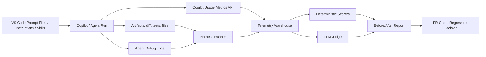
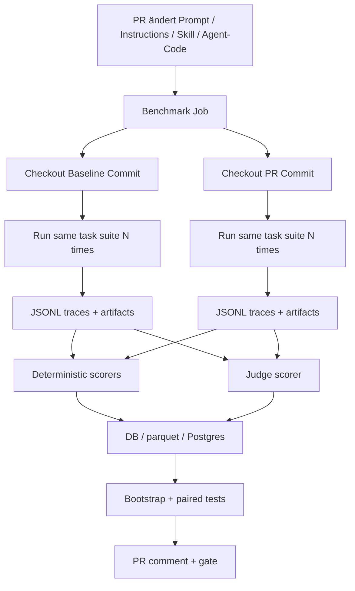

# Messung der Output-Qualität von AI-Harnesses in VS Code und GitHub Copilot

## Executive Summary

Der belastbarste Weg, Änderungen an **Agent-Instruktionen, Prompt-Dateien, Skills oder Harness-Logik** in VS Code plus GitHub Copilot zu bewerten, ist **nicht** ein einzelner Score, sondern ein **mehrschichtiges Messsystem**: erstens harte, deterministische Prüfungen auf Artefakten und Tests; zweitens workflow-nahe Erfolgsmetriken wie **Task Success**, **Time-to-Green** und **Invalid-Tool-Call-Rate**; drittens Kosten- und Stabilitätsmetriken wie **Cost-per-Success**, **Variance** und **Regression Stability**; viertens nur ergänzend **LLM-as-a-judge** mit sauberem Rubrik- und Pairwise-Protokoll. Genau diese Richtung wird 2025–2026 in aktuellen offiziellen Praktiken und Toolchains verstärkt: GitHub trennt Nutzungsmetriken von Outcome-Messung, OpenAI empfiehlt „captured run + checks + score“, und mehrere aktuelle Frameworks verschieben sich sichtbar von reinen Prompt-Scores zu Trace-, Tool- und Agent-Evaluierung. **Datenstand:** GitHub Docs/Blog 2025-08-14 bis 2026-05-08, Alter 287 bis 20 Tage; OpenAI 2026-01-22 bis 2026-05-19, Alter 126 bis 9 Tage; DeepEval/Promptfoo/LangSmith/Braintrust/Inspect/Langfuse GitHub- und Doku-Snapshots 2026-04 bis 2026-05, Alter 0 bis 56 Tage. citeturn19view2turn19view3turn29view0turn29view2turn24view1turn24view3turn24view4turn24view7turn24view6turn34view4

Für **VS Code + GitHub Copilot** gilt 2026 konkret: Copilot bietet inzwischen offizielle **usage metrics** für Adoption, Engagement, Acceptance Rate, LoC und Pull-Request-Lifecycle, aber GitHub positioniert diese Daten erkennbar als **Nutzungs- und Rollout-Sicht**, nicht als vollständige Qualitätsmessung. Die Daten sind außerdem aggregiert, hängen an IDE-Telemetrie, sind typischerweise innerhalb von zwei vollen UTC-Tagen verfügbar und haben an mehreren Stellen bekannte Grenzen, etwa fehlende Repo-Granularität, reduzierte historische Fenster oder inkonsistente Wahrnehmung in Community-Diskussionen. Als **alleinige** Messbasis für Prompt- oder Skill-Änderungen sind sie deshalb zu grob; als **ergänzender Side-Channel** für Akzeptanz, Adoption und Applied Suggestions sind sie dennoch wertvoll. **Datenstand:** GitHub Docs/Community 2025-08-14 bis 2026-05-12, Alter 287 bis 16 Tage. citeturn19view0turn19view1turn19view2turn21view1turn42search0turn42search2turn42search3turn42search4turn42search5

Für modelseitige Aktualität ist 2026 wichtig: GitHub Copilot listet in der deutschen Dokumentation aktuell unter anderem **GPT-5.4**, **GPT-5.5**, **Claude Opus 4.6**, **Claude Opus 4.7**, **Claude Sonnet 4.6**, **Gemini 3.1 Pro** und weitere Modelle; zugleich weist GitHub explizit darauf hin, dass sich Modellverfügbarkeit ändern kann. Wenn du Harness-Änderungen misst, solltest du deshalb **nie** die automatische Modellauswahl als Kontrollbedingung verwenden, sondern Modell, Version, Routing-Modus und Prompt-/Instructions-Stand explizit pinnen. **Datenstand:** GitHub Docs DE, Snapshot 2026-05-28, Alter 0 Tage. citeturn23view0turn22search2turn22search7turn22search8

Für **the project** konnte ich in dieser Sitzung **keine öffentliche Repository-Struktur verifizieren**; die öffentliche GitHub-URL war in der Web-Ansicht nicht verfügbar. Deshalb ist der the project-Teil unten als **verifizierungsbewusster Implementierungsplan** für ein typisches VS-Code-/Copilot-/GitHub-Actions-Repo formuliert und **nicht** als behauptete Bestandsaufnahme eurer aktuellen Ordnerstruktur. citeturn3view0

## Verifizierte Ausgangslage für VS Code und Copilot

GitHub Copilot Usage Metrics sind 2026 offiziell allgemein verfügbar. GitHub beschreibt sie als einheitliche Sicht auf Adoption und Nutzung, inklusive Code-Completion-, IDE-, Modell- und Sprach-Breakdowns; außerdem gibt es inzwischen Code-Generation-Dashboards und API-Zugriff auf Enterprise-, Organisations- und User-Ebene. GitHub selbst formuliert den nächsten Schritt ausdrücklich als Übergang von „Adoption messen“ zu „Impact messen“. Das ist eine direkte Bestätigung dafür, dass Copilot-Nutzungsmetriken allein keine belastbare Antwort auf die Frage geben, ob eine **Instruktions- oder Prompt-Änderung** deine Agent-Qualität verbessert hat. **Datenstand:** GitHub Changelog 2026-02-27, Alter 90 Tage; GitHub Docs Snapshot 2026-05-28, Alter 0 Tage. citeturn21view1turn19view0turn19view2

GitHub dokumentiert außerdem präzise, was diese Metriken messen: **Adoption**, **Engagement**, **Acceptance Rate**, **Lines of Code** und **PR-Lifecycle-Metriken**. Die Docs sagen explizit, dass eine hohe Acceptance Rate Relevanz und Vertrauen signalisiert, nicht aber automatisch Korrektheit. Ebenso ist eine WAU/Lizenz-Quote von über 60 % laut GitHub ein gesundes Rollout-Signal; das ist nützlich für Governance, aber kein Qualitätskriterium auf Harness-Ebene. **Datenstand:** GitHub Docs Snapshot 2026-05-28, Alter 0 Tage. citeturn19view0turn19view1

Für die eigentliche Harness-Arbeit in VS Code sind 2025–2026 drei offizielle Integrationspunkte entscheidend. Erstens **Prompt Files** in `.github/prompts`, die manuell aufgerufen werden und Agent, Modell und Tools deklarieren können. Zweitens **Repository- und Path-spezifische Instructions** über `copilot-instructions.md` und `.instructions.md`. Drittens **Agent Debug Logs** in VS Code, die über `github.copilot.chat.agentDebugLog.enabled` und `github.copilot.chat.agentDebugLog.fileLogging.enabled` aktivierbar sind. Seit der Februar-2026-Release betont VS Code außerdem mehr Sichtbarkeit auf Agent-Events, Tool Calls und geladene Customizations; seit April 2026 ist Copilot Chat in VS Code sogar built-in. **Datenstand:** VS Code/GitHub Docs 2025-03-26 bis 2026-04-15, Alter 428 bis 43 Tage; VS Code/Copilot Settings Snapshot 2026-05-28, Alter 0 Tage. citeturn20view0turn20view1turn20view2turn19view4turn19view5turn19view6turn19view7

Die praktische Konsequenz ist klar: Für Harness-Änderungen in VS Code plus Copilot brauchst du **drei Datenebenen gleichzeitig**. Die **IDE-/Copilot-Ebene** liefert Nutzungs- und Akzeptanzsignale. Die **Harness-/Trace-Ebene** liefert Tool-Aufrufe, Schrittfolgen, Dateieffekte und Kosten. Die **CI-/Task-Ebene** liefert reproduzierbare Outcome-Metriken auf kuratierten Fällen. Aktuelle OpenAI-Leitfäden formulieren denselben Kern in anderer Sprache: Ein Eval ist „Prompt → captured run (trace + artifacts) → checks → score“. **Datenstand:** OpenAI 2026-01-22, Alter 126 Tage; VS Code/GitHub Docs 2026-03 bis 2026-05, Alter 85 bis 20 Tage. citeturn29view0turn19view6turn19view3



## Die Metriken, die für Harness-Änderungen wirklich funktionieren

Die folgende Matrix priorisiert **Harness-nahe** Metriken, also Metriken, die Änderungen an Prompt, Instructions, Skill, Tool-Wiring oder Agent-Loop messen, statt nur Modellqualität zu spiegeln.

| Metrik | Definition und Relevanz | Benötigte Daten | Erfassung in VS Code + Copilot | Formel, Statistik, Richtwert, Grenzen | Quelle, Datum, Alter |
|---|---|---|---|---|---|
| **Task Success / Goal Completion** | Anteil der Läufe, in denen das Ziel wirklich erreicht wurde. Das ist die wichtigste Outcome-Metrik, weil sie auf Systemebene misst, ob der Harness die Aufgabe löst. | Gold-Cases, Endzustand, Tests, Artefakte, optional Judge | Kuratierte Task-Suite in CI; Debug-Logs + verifizierende Checks; DeepEval `TaskCompletionMetric`; LangSmith/Braintrust/Inspect/OpenAI Evals | `success_rate = solved_runs / total_runs`; für Vorher/Nachher gepaart per Task messen; **McNemar** für binäre gepaarte Einzelläufe, sonst **clustered bootstrap** über Tasks; als PR-Gate empfehle ich: keine Regression > 2 Prozentpunkte ohne Gegengewinn bei Kosten/Latenz. Grenze: hängt stark von Case-Qualität ab. | OpenAI Skills-Evals und Evals-Guide; DeepEval Agent-Eval; LangSmith Evaluation. **2026-01-22 bis 2026-05-14, Alter 126 bis 14 Tage.** citeturn29view0turn29view1turn26search7turn26search9turn24view4 |
| **Resolution@k / Green@k / JudgePass@k** | Harness-adaptierte Variante von `pass@k`: Wie oft gewinnt mindestens einer von `k` unabhängigen Läufen. Für nichtdeterministische Agenten oft aussagekräftiger als nur `pass@1`. | Mehrfachläufe pro Case, identische Task-Definition | Runner führt pro Task `k` Wiederholungen aus; Varianten getrennt nach kalt/warmem Cache und identischem Modell | `resolved@k = any(run_i == success)`; für gerechte A/B-Vergleiche `k` identisch halten; Bootstrap über Tasks; empfehlenswert: `k=5` für PRs, `k=20` für Release-Kandidaten. Grenze: kann schlechte Stabilität kaschieren, daher immer mit Varianz kombinieren. | OpenAI empfiehlt captured-run-basierte Evals; aktuelle Coding-Agent-Benchmarks betonen wiederholte und dekontaminierte Bewertung. **2025-05-26 bis 2026-05-19, Alter 367 bis 9 Tage.** citeturn29view2turn29view3turn15search3turn29view4 |
| **Time-to-Green** | Zeit vom Start des Laufs bis zum ersten Zustand „Build+Tests grün“. Sehr harness-relevant, weil bessere Instructions oft unnötige Schleifen, Dateilesen und Tool-Umwege reduzieren. | Start-/Endzeit, Testgrün-Ereignis | Runner protokolliert Run-Start, ersten grünen Testlauf, finalen Abschluss; optional getrennt nach lokaler IDE und GitHub Actions | Median statt Mittelwert; **Wilcoxon signed-rank** oder gepaarter Bootstrap auf Median-Differenz; Richtwert: Regression > 10 % nur akzeptieren, wenn Success signifikant steigt. Grenze: stark von Infra und Cache beeinflusst. | GitHub beschreibt PR- und Code-Generation-Metriken nur als directional; aktuelle Agent-Frameworks und Coding-Agent-Guides messen Laufzeit und Kosten explizit mit. **2026-02-27 bis 2026-05-21, Alter 90 bis 7 Tage.** citeturn21view1turn26search10turn40view0 |
| **Acceptance / Applied Suggestion / Rollback Rate** | Für Copilot gibt es zwei brauchbare Trust-Signale: IDE-Acceptance und bei Code Review die Applied-Suggestion-Rate. Ergänzend brauchst du eine eigene Rollback-/Revert-Rate, weil Accept != Correct. | Copilot Usage Metrics API, PR-Historie, Git-History | GitHub Usage Metrics API; zusätzlich Revert-Scanner im Repo (`reverted_within_72h`) | Acceptance/Applied als sekundäre Ziele; Revert-Rate als Primärschutz. Statistik: Zwei-Proportionen-Bootstrap oder McNemar bei gepaarten PR-Fällen; Richtwert: Acceptance nie isoliert optimieren. Grenze: organisatorisch und teamkulturell verzerrt. | GitHub Docs und Changelog; Community meldet zudem Mismatch- und Granularitätsprobleme. **2025-08-14 bis 2026-05-12, Alter 287 bis 16 Tage.** citeturn19view1turn19view2turn19view3turn42search0turn42search3turn42search4 |
| **Regression Stability / Variance** | Nicht nur das Mittel zählt, sondern die Streuung. Ein Harness, der manchmal brillant und oft chaotisch ist, ist im Team meist schlechter als ein etwas schwächerer, aber stabiler Harness. | Wiederholte Läufe pro Case | N-fache Wiederholung je Task; getrennte Serien für Baseline und Änderung | Miss `stddev`, `IQR`, 90. Perzentil, `coef_var`; Tests: **Brown-Forsythe/Levene** für Varianz, Bootstrap für Perzentile; Richtwert: keine Erhöhung des 90. Perzentils > 15 % ohne klaren Qualitätsgewinn. Grenze: teuer in Tokens und Laufzeit. | LangSmith Multi-turn-Simulation weist explizit auf sinkende Konsistenz bei größerer Evaluationsoberfläche hin; aktuelle Behaviour-Studien erklären, warum Trajektorien stark variieren. **2026-04-02 bis 2026-05-28, Alter 56 bis 0 Tage.** citeturn27search3turn31view1turn27search11 |
| **Invalid Tool Call / Tool Correctness / Skill Invocation** | Misst, ob der Harness die **richtigen** Tools mit den **richtigen** Argumenten aufruft und ob eine definierte Skill/Instruction überhaupt triggert. Für Prompt-/Instruction-Änderungen oft wichtiger als Final-Textqualität. | Tool-Calls, Parameter, Trace, erwartete Workflow-Schritte | Agent Debug Logs, OTel/OpenInference-Spans, Runner-Instrumentierung, DeepEval `Tool Correctness`, OpenAI-Skill-Checks | Beispiele: `invalid_tool_call_rate`, `expected_command_coverage`, `skill_invocation_rate`; Statistik: binär oder prozentual gepaart; Richtwert: `invalid_tool_call_rate < 3%`, kritische Kommandos 100 % Coverage. Grenze: Bedarf guter Workflow-Spezifikation. | OpenAI Skills-Evals; DeepEval Agent-Metriken; Inspect/Promptfoo/OTel-Tracing. **2026-01-22 bis 2026-05-14, Alter 126 bis 14 Tage.** citeturn29view0turn24view2turn26search1turn26search9turn24view6turn26search18 |
| **Repair Cost / Human Takeover Cost** | Wie viel Nacharbeit der Mensch leisten muss: Review-Minuten, Korrektur-LOC, zusätzliche Prompts, Hotfix-Läufe. Für Teams oft die realistischste Wirtschaftlichkeitsmetrik. | Review-Dauer, Nachfolge-Commits, Fix-up-LOC, zusätzliche Agent-Runs | PR-Metadaten, Git-Diff nach erstem Agent-PR, optional Zeiterfassung im Review-Tool | `repair_cost = review_minutes + fixup_loc_weighted + reruns_weighted`; Statistik: Bootstrap; Richtwert: Kosten pro erfolgreichem Task sinken oder dürfen nur bei stark höherem Success steigen. Grenze: Review-Zeit muss diszipliniert erfasst werden. | GitHub selbst baut „Impact“-Sicht erst auf; Community- und Produkt-Frameworks gehen deshalb auf Experiment-/Trace-Ebene. **2026-02-27 bis 2026-05-19, Alter 90 bis 9 Tage.** citeturn21view1turn24view7turn29view2 |
| **Token Efficiency / Cost per Success / Latency per Success** | Zentral für agentische Harnesses, weil dieselbe Success Rate bei halben Kosten klar besser ist. | Input-/Output-Tokens, Kosten, Laufzeit, Erfolgsflag | Provider-/Trace-Daten, OTel/OpenInference, Promptfoo `cost`, Phoenix/Langfuse/Braintrust/DeepEval Traces | `cost_per_success = total_cost / solved_runs`; `tokens_per_success`, `latency_per_success`; gepaarter Bootstrap; Richtwert: Kostensteigerung > 15 % braucht klaren Outcome-Gewinn. Grenze: Providerpreise ändern sich; warm/cold cache trennen. | Promptfoo deterministic `cost`; Phoenix/OpenInference; Braintrust/DeepEval/Langfuse Traces. **2026-05-15 bis 2026-05-28, Alter 13 bis 0 Tage.** citeturn26search0turn24view8turn11search6turn24view7turn24view3turn34view4 |
| **Semantic Diff / Scope Precision / AST-Struktur** | Misst, ob die Änderung semantisch am richtigen Ort und in der richtigen Breite passiert. Wichtig, weil ein Harness häufig „funktioniert“, aber unnötig breit editiert. | Gold-Patch oder Soll-Dateien, AST, geänderte Dateien, Edit-Spans | Diff-Parser + AST-Level-Analyse in CI | Beispiele: Datei-Precision/Recall, `gold_file_overlap`, geänderte AST-Nodes, unnötige Touches. Tests: Bootstrap pro Task; Richtwert: Scope-Precision steigern, unnötige Dateien senken. Grenze: braucht Gold oder לפחות Soll-Scope. | SWE-PolyBench führt neuartige syntax-tree-basierte Metriken ein; neuere Benchmarks betonen reasoning- und scope-aware Auswertung. **2025-04-11 bis 2026-03-27, Alter 412 bis 62 Tage.** citeturn13search2turn13search15turn38search0turn30view2 |
| **LLM-as-a-Judge mit Rubrik und Pairwise-Protokoll** | Sinnvoll für Stil, Vollständigkeit, Nutzwert, Review-Qualität und zu weit offene Aufgaben. Für Harness-Änderungen ist **pairwise** meist robuster als isolierte Punkt-Scores. | Vorher-/Nachher-Ausgaben, Rubrik, optional Referenzlösung | LangSmith/OpenEvals, Promptfoo `llm-rubric`/`select-best`, DeepEval `G-Eval`, OpenAI Evals | Verwende feste Rubriken, Blind-Pairing, kurze Begründungen, getrennte Judge-Modelle; Statistik: gepaarte Win-Rate + Bootstrap-CI; Richtwert: erst ab >55 % Pairwise-Win-Rate und ohne harte Regression deployen. Grenze: Judge-Drift und Kosten. | Promptfoo Assertions; DeepEval G-Eval; LangSmith/OpenEvals; OpenAI Evals. **2025-02-26 bis 2026-05-28, Alter 457 bis 0 Tage.** citeturn26search3turn26search8turn24view2turn24view4turn27search1turn27search16turn29view1 |
| **Reasoning Recall / Over-Prediction** | Neuere 2026-Praxis: nicht nur Patch-Erfolg messen, sondern ob der Agent die richtigen Zwischenschritte erkennt und keine unnötigen Schritte halluziniert. Hochrelevant für Instructions/Skills. | Strukturierte Zwischenpläne, erwartete Schritte, tatsächliche Trace | Plan-Extraktion aus Trace; Mapping auf Soll-Schritte | `reasoning_recall`, `over_prediction_rate`; bei Harness-Änderungen besonders wertvoll für Planning-/Skill-Dateien. Grenze: braucht Schritt-Ground-Truth oder gute Heuristiken. | RACE-bench zeigt genau diese duale Auswertung und berichtet 35,7 % niedrigeren Recall sowie 94,1 % höhere Over-Prediction in apply-success-but-test-fail-Fällen. **2026-03-27, Alter 62 Tage.** citeturn38search0turn30view2 |
| **Behavioral Anomaly Rate / Artifact Hygiene** | 2026 besonders nützlich: misst unerwünschte Verhaltensmuster wie falsche Dateiänderungen, Extra-Dateien, unerlaubte Löschungen, unnötige Side Effects oder Workflow-Verstöße. | User-Stories, Fuzz-Cases, Trace, Dateisystem-Artefakte | Behavior-Driven Fuzzing-Suite nach ABTest-Muster; Dateisystem-Snapshots vor/nach Run | `anomaly_rate`, `artifact_pollution_rate`, `unauthorized_edit_rate`; Precision der Anomalie-Fahne manuell auf Stichprobe kalibrieren. Grenze: initialer Suite-Bau aufwendig. | ABTest minte 400 bestätigte Failure-Reports, erzeugte 647 repo-grounded Fälle und fand 1.573 Anomalien, davon 642 manuell bestätigt; Precision 40,8 %. **2026-04-22, Alter 36 Tage.** citeturn31view0 |
| **Produktivitäts-Proxys** | Nicht „wahre Produktivität“, sondern brauchbare Näherungen: PR-Durchlaufzeit, Review-Turnaround, Anzahl erfolgreich geschlossener Tasks je Woche, Wartezeit bis erster nutzbarer Patch. | PR-/Issue-Metadaten, CI-Zeiten, Run-Ergebnisse | GitHub API/PR-Daten, Copilot Usage Metrics als Seitensignal | Nur im Paket mit Qualitätsmetriken verwenden; Statistik: Difference-in-Differences oder gepaarte Zeitfenster. Grenze: sozial und organisatorisch stark verzerrt. | GitHub misst PR-Lifecycle und spricht selbst von „directional“ Code-Generation/Adoption, nicht von finaler Engineering-Produktivität. **2026-02-27 bis 2026-05-28, Alter 90 bis 0 Tage.** citeturn21view1turn19view0turn19view2 |

Mein klares Urteil daraus: **Die besten Kernmetriken für dein Ziel sind**  
**Task Success**, **Resolution@k**, **Time-to-Green**, **Invalid Tool Call / Tool Correctness**, **Cost per Success**, **Variance**, **Repair Cost** und eine **pairwise LLM-judge Win-Rate**. Alles andere ist nützlich, aber eher zweite Reihe. citeturn29view0turn26search7turn31view0turn38search0

## So implementierst du das in VS Code und GitHub Copilot

Der Implementierungsansatz sollte so aussehen: Du behandelst jede Harness-Änderung wie einen kleinen Experiment-Branch. Dieselben Fälle laufen **vor** und **nach** der Änderung gegen denselben Repo-Stand, dasselbe Modell, dieselben Tool-Rechte und dieselben Build-Schritte. Aus jedem Lauf speicherst du **Trace**, **Artefakte**, **Diff**, **Tests**, **Kosten**, **Laufzeit** und optional einen Judge-Score. Erst dann vergleichst du Varianten. Dieser „immutable experiment snapshot“-Gedanke zieht sich konsistent durch Braintrust, LangSmith und OpenAIs neuere Eval-Leitfäden. **Datenstand:** Braintrust/ LangSmith / OpenAI 2026-05, Alter 16 bis 0 Tage. citeturn24view7turn24view4turn29view3

### Referenzarchitektur



### Empfohlene Projektstruktur für einen Harness-Benchmark

Da ich die aktuelle the project-Struktur nicht verifizieren konnte, ist dies ein **zielbildorientiertes Layout**, das für ein gemischtes .NET-/TypeScript-Repo mit VS Code und Copilot praktikabel ist:

```text
.github/
  copilot-instructions.md
  instructions/
    backend.instructions.md
    frontend.instructions.md
  prompts/
    fix-bug.prompt.md
    add-tests.prompt.md
  workflows/
    ai-harness-benchmark.yml

benchmarks/
  datasets/
    critical-path.jsonl
    regression-edge-cases.jsonl
    fuzz-anomalies.jsonl
  rubrics/
    judge-rubric.yaml
  scripts/
    run-harness.ts
    score-deterministic.ts
    score-judge.ts
    compare.ts
  snapshots/
    baseline/
    pr/

telemetry/
  schema/
    run_event.schema.json
    tool_call.schema.json
    judge_score.schema.json

src/
  TheProject.AI/
  TheProject.AI.Telemetry/

tests/
  TheProject.AI.Benchmarks/
```

Die wichtigsten VS-Code-/Copilot-Anknüpfungspunkte sind dabei offiziell dokumentiert: Prompt Files liegen standardmäßig in `.github/prompts`; Repository- und Path-Instructions in `copilot-instructions.md` und `.instructions.md`; VS Code kann Agent-Debug-Logs inklusive File-Logging schreiben; GitHub Copilot kann projektspezifische Build-, Test- und Validierungsanweisungen aus Repo-Instructions ziehen. **Datenstand:** VS Code/GitHub Docs Snapshot 2026-05-28, Alter 0 Tage; GitHub Blog 2026-02-26, Alter 92 Tage. citeturn20view0turn20view2turn19view4turn19view5turn20view3

### Telemetrieschema

Ich würde mindestens folgende Entitäten dauerhaft speichern:

```json
{
  "run_id": "uuid",
  "variant_id": "baseline|pr-123",
  "repo_commit": "sha",
  "task_id": "critical-path-017",
  "task_family": "calendar-import|sync|ui-fix|perf",
  "model_id": "gpt-5.5",
  "model_mode": "pinned",
  "prompt_file": "fix-bug.prompt.md@sha256",
  "instructions_file_set": ["copilot-instructions.md@sha256", "backend.instructions.md@sha256"],
  "started_at_utc": "2026-05-28T08:12:14Z",
  "ended_at_utc": "2026-05-28T08:15:49Z",
  "success": true,
  "time_to_green_ms": 97234,
  "final_latency_ms": 214829,
  "tool_calls_total": 17,
  "tool_calls_invalid": 1,
  "files_read": 22,
  "files_edited": 4,
  "tests_failed_before": 3,
  "tests_passed_after": 148,
  "tokens_input": 48211,
  "tokens_output": 10944,
  "cost_usd_estimate": 0.84,
  "judge_score": 0.92,
  "judge_pairwise_win": true,
  "repair_loc_after_human": 8,
  "reverted_within_72h": false,
  "artifact_pollution": 0
}
```

Für Speicherung reicht anfangs **PostgreSQL** mit `JSONB`-Spalten oder einfach **Parquet/JSONL** pro Run. Sobald du Trends, Drilldowns und PR-Kommentare willst, wird Postgres praktischer. Für Copilot-Usage-Metriken ist ein separates historisches Sammeln sinnvoll, weil das neue Modell auf Rolling-Reports ausgerichtet ist und Community-Diskussionen die Grenzen des Fensters und der Granularität zeigen; das offizielle Copilot Metrics Viewer-Repo ergänzt deshalb einen PostgreSQL-Historical-Mode mit täglichem Sync. **Datenstand:** GitHub Community 2026-01-31 bis 2026-05-12, Alter 117 bis 16 Tage; Copilot Metrics Viewer Repo Snapshot 2026-05-28, Alter 0 Tage. citeturn42search0turn42search2turn42search3turn34view5

### TypeScript-Runner

```ts
// benchmarks/scripts/run-harness.ts
import fs from "node:fs/promises";
import crypto from "node:crypto";
import { performance } from "node:perf_hooks";

type TaskCase = {
  id: string;
  prompt: string;
  expectedFiles?: string[];
  expectedCommands?: string[];
  taskFamily: string;
};

type RunEvent = {
  run_id: string;
  variant_id: string;
  task_id: string;
  task_family: string;
  model_id: string;
  success: boolean;
  time_to_green_ms: number | null;
  final_latency_ms: number;
  tool_calls_total: number;
  tool_calls_invalid: number;
  files_read: number;
  files_edited: number;
  tokens_input: number;
  tokens_output: number;
  cost_usd_estimate: number;
  artifact_pollution: number;
  judge_score?: number;
};

function id() {
  return crypto.randomUUID();
}

async function runTask(task: TaskCase, variantId: string): Promise<RunEvent> {
  const started = performance.now();

  // TODO: Hier deinen eigentlichen Harness-Call einsetzen:
  // - VS Code/Copilot Agent Task starten
  // - oder euren lokalen Agent-Runner
  // - Logs / Spans / Filesystem-Events einsammeln

  const trace = {
    toolCalls: [
      { name: "search/codebase", valid: true },
      { name: "terminal", valid: true },
    ],
    filesRead: 10,
    filesEdited: 2,
    tokensIn: 12000,
    tokensOut: 4200,
    costUsd: 0.31,
    timeToGreenMs: 58000,
    success: true,
    artifactPollution: 0,
  };

  const ended = performance.now();

  return {
    run_id: id(),
    variant_id: variantId,
    task_id: task.id,
    task_family: task.taskFamily,
    model_id: process.env.MODEL_ID ?? "gpt-5.5",
    success: trace.success,
    time_to_green_ms: trace.timeToGreenMs,
    final_latency_ms: Math.round(ended - started),
    tool_calls_total: trace.toolCalls.length,
    tool_calls_invalid: trace.toolCalls.filter(t => !t.valid).length,
    files_read: trace.filesRead,
    files_edited: trace.filesEdited,
    tokens_input: trace.tokensIn,
    tokens_output: trace.tokensOut,
    cost_usd_estimate: trace.costUsd,
    artifact_pollution: trace.artifactPollution,
  };
}

async function main() {
  const tasks: TaskCase[] = JSON.parse(
    await fs.readFile("benchmarks/datasets/critical-path.jsonl", "utf8")
      .then(txt => `[${txt.trim().split("\n").join(",")}]`)
  );

  const variantId = process.env.VARIANT_ID ?? "baseline";
  const results: RunEvent[] = [];

  for (const task of tasks) {
    results.push(await runTask(task, variantId));
  }

  await fs.mkdir("benchmarks/out", { recursive: true });
  await fs.writeFile(
    `benchmarks/out/${variantId}.jsonl`,
    results.map(r => JSON.stringify(r)).join("\n")
  );
}

main().catch(err => {
  console.error(err);
  process.exit(1);
});
```

### .NET-Telemetry-Sink

```csharp
// src/TheProject.AI.Telemetry/RunEvent.cs
namespace TheProject.AI.Telemetry;

public sealed record RunEvent(
    Guid RunId,
    string VariantId,
    string TaskId,
    string TaskFamily,
    string ModelId,
    bool Success,
    long? TimeToGreenMs,
    long FinalLatencyMs,
    int ToolCallsTotal,
    int ToolCallsInvalid,
    int FilesRead,
    int FilesEdited,
    int TokensInput,
    int TokensOutput,
    decimal CostUsdEstimate,
    int ArtifactPollution,
    decimal? JudgeScore
);

// src/TheProject.AI.Telemetry/JsonlTelemetrySink.cs
using System.Text.Json;

namespace TheProject.AI.Telemetry;

public sealed class JsonlTelemetrySink
{
    private readonly string _path;

    public JsonlTelemetrySink(string path)
    {
        _path = path;
        Directory.CreateDirectory(Path.GetDirectoryName(path)!);
    }

    public async Task AppendAsync(RunEvent evt, CancellationToken ct = default)
    {
        var json = JsonSerializer.Serialize(evt);
        await File.AppendAllTextAsync(_path, json + Environment.NewLine, ct);
    }
}
```

### GitHub-Actions-Pipeline

```yaml
name: ai-harness-benchmark

on:
  pull_request:
    paths:
      - ".github/prompts/**"
      - ".github/instructions/**"
      - ".github/copilot-instructions.md"
      - ".github/agents/**"
      - "benchmarks/**"
      - "src/**"

jobs:
  benchmark:
    runs-on: ubuntu-latest
    strategy:
      matrix:
        variant: [baseline, pr]
        repeat: [1, 2, 3, 4, 5]

    steps:
      - uses: actions/checkout@v4

      - name: Select baseline or PR ref
        run: |
          if [ "${{ matrix.variant }}" = "baseline" ]; then
            git fetch origin ${{ github.event.pull_request.base.ref }}
            git checkout origin/${{ github.event.pull_request.base.ref }}
          fi

      - uses: actions/setup-node@v4
        with:
          node-version: 22

      - name: Install
        run: npm ci

      - name: Run harness suite
        env:
          VARIANT_ID: ${{ matrix.variant }}-r${{ matrix.repeat }}
          MODEL_ID: gpt-5.5
        run: node benchmarks/scripts/run-harness.ts

  compare:
    needs: benchmark
    runs-on: ubuntu-latest
    steps:
      - uses: actions/checkout@v4
      - name: Compare
        run: node benchmarks/scripts/compare.ts
```

## Aktuelle Tool- und Repo-Landschaft für Harness-Evaluation

Die 2025–2026-Landschaft teilt sich grob in zwei Lager: **lokal-konfigurierbare Eval-Harnesses** wie Promptfoo und DeepEval, und **Tracing-/Experiment-Plattformen** wie LangSmith, Braintrust, Phoenix und Langfuse. Für dein Ziel – **vorher/nachher** bei Harness-Änderungen – ist meistens die beste Kombination ein **lokaler Runner + zentrales Tracing/Experiment-Store**. **Datenstand:** Promptfoo/DeepEval/LangSmith/Braintrust/Inspect/Langfuse/Phoenix Snapshots 2026-04 bis 2026-05, Alter 0 bis 56 Tage. citeturn24view0turn24view2turn24view4turn24view7turn24view6turn34view4turn24view8

| Tool / Repo | Wie es arbeitet | Relevante Metriken und Praktiken | Lizenz | 2026-Maintenance-Evidenz | Einschätzung für Harness-Änderungen | Community-Sentiment |
|---|---|---|---|---|---|---|
| **promptfoo/promptfoo** | YAML-/CLI-zentrierte lokale Evals; GitHub Action für automatische Before/After-PR-Vergleiche; OTel-Tracing und Agent-Eval-Guides. | Deterministische Assertions, Kosten, Latency, `llm-rubric`, `select-best`, `max-score`, Coding-Agent-Guide. | **MIT**. citeturn24view0 | Release `0.121.12` am **2026-05-21**, Alter 7 Tage; Features enthalten unter anderem `eval`-Erweiterungen und Import aus OpenAI-Evals-Exports. citeturn40view0 | **Sehr stark** für PR-Gating, lokale Reproduzierbarkeit, A/B von Prompts/Skills. Weniger stark als zentrales Langzeit-Observability-System. | Tendenziell positiv als „Regression Gate“ und CI-Werkzeug; 2025 wählte LobeHub Promptfoo explizit als QA-Basis für Prompt-Qualität. citeturn10search16turn16search0 |
| **confident-ai/deepeval** | Pytest-artiger Eval-Workflow; agent-native Tracing; Task-Completion und Tool-Correctness; seit 2026 explizit auf Coding-Agent-Loops ausgerichtet. | `TaskCompletionMetric`, `ToolCorrectness`, G-Eval, agent tracing, MCP-Evals, TUI. | **Apache-2.0**. citeturn24view2 | Release `v4.0.2` am **2026-05-13**, Alter 15 Tage; Release Notes nennen explizit „Eval Harness for Coding Agents“. citeturn39search1 | **Sehr stark** für Agent-/Harness-nahe Messung, vor allem wenn du Python-basierte Eval-Suites akzeptierst. | Positiv für Metrik-Breite; zugleich zeigen Issues und Reddit, dass Provider-/Account-/Konfigurationsfragen Reibung erzeugen können. citeturn16search2turn33search1turn33search4 |
| **LangSmith + langchain-ai/openevals** | Datasets, Offline-/Online-Evaluation, Pairwise, Chat-Simulation; OpenEvals liefert vorgefertigte Evaluatoren, LangSmith die Experiment-/Trace-Oberfläche. | Human, code rules, LLM judge, pairwise, multi-turn simulation, reusable evaluator templates. | **OpenEvals: MIT**; **LangSmith selbst: proprietäre SaaS/Doku, nicht als Open-Source-Lizenz im erfassten Material verifiziert**. citeturn24view5 | OpenEvals Release `0.2.0` am **2026-04-07**, Alter 51 Tage; wiederverwendbare Evaluator-Templates mit multimodalem Support im April 2026. citeturn24view5turn27search6 | **Sehr stark**, wenn du schon im LangChain-/LangGraph-Ökosystem bist; sonst Integrations-/Lock-in-Kosten. | In Reddit-/Forum-Diskussionen häufig „stark im LangChain-Stack, aber lock-in-/kostenlastig bzw. boxed-in“. citeturn16search5turn32search1turn32search4turn32search8 |
| **Braintrust SDK / Autoevals / eval-action** | Immutable Experiments, CI/CD-Evals und automatische Bewertung; Autoevals bündelt LLM-judge, heuristische und statistische Methoden. | Experiments, snapshots, LLM-as-judge, Levenshtein/BLEU, CI Action. | **braintrust-sdk-python: Apache-2.0**; **Autoevals-Lizenz im erfassten Material nicht verifiziert**. citeturn34view2turn34view0 | Python SDK Release `0.22.1` am **2026-05-22**, Alter 6 Tage; GitHub Action vorhanden. citeturn34view2turn34view1 | **Sehr stark** für teamfähige Experimenthistorie und CI-Gates; weniger „Editor-nativ“ als Promptfoo. | Im Marktbild 2026 oft als stark für Produktion und Experimente wahrgenommen; zugleich eher Plattform als reines Local-CLI-Tool. citeturn25search10turn16search0 |
| **UKGovernmentBEIS/inspect_ai** | Forschungsnaher Eval-Framework-Ansatz mit Tool Usage, Multi-Turn-Dialog und model-graded evaluations. | Prompt engineering, tool usage, multi-turn dialog, graded evaluations. | **MIT**. citeturn24view6 | Changelog-Aktivität bis **2026-05-03**, Alter 25 Tage. citeturn26search2 | **Sehr gut** für reproduzierbare, benchmark-artige Harness-Evals; schwergewichtiger für typische Produktteams. | Positiv in Research-/Evaluation-Kontexten, weniger häufig als leichtgewichtiges App-Team-Tool diskutiert. citeturn11search12turn12search3 |
| **langfuse/langfuse** | Self-hosted LLM-Engineering-Plattform mit Traces, Evals, Datasets und Live Evaluators. | Experiments, live evaluators, tracing, observability. | **Lizenz im erfassten Material nicht verifiziert**. citeturn34view3 | Release `v3.175.0` am **2026-05-21**, Alter 7 Tage; neue Monitoring-/Evaluator-Features im Release log. citeturn41view0 | **Stark** als self-hosted Beobachtungs- und Evaluations-Basis; als reines PR-Gating etwas indirekter als Promptfoo/DeepEval. | Community schätzt Self-Hosting; Diskussionen zeigen aber, dass komplexe Live-/Dataset-Evaluation sauber verstanden werden muss. citeturn25search8turn25search12turn25search16turn16search10 |
| **github-copilot-resources/copilot-metrics-viewer** | Dashboard für Copilot Usage Metrics mit Historical Mode auf PostgreSQL. | Adoption, acceptance, editor/model/language breakdowns, history sync. | **Lizenz im erfassten Material nicht verifiziert**. citeturn34view5 | v3.0 nutzt die neue Usage Metrics API und ergänzt Historical Mode mit PostgreSQL. Snapshot 2026-05-28, Alter 0 Tage. citeturn34view5 | **Kein vollständiges Harness-Eval-Tool**, aber sehr guter Companion für Adoption/Acceptance/Applied-Suggestion-Seitensignale. | Community rund um Copilot-Metriken betont Nutzen, aber auch Lücken bei Team-/Repo-Sicht und rolling windows. citeturn42search0turn42search2turn42search3 |

Mein Ranking für deinen Einsatzzweck ist deshalb:

1. **Promptfoo + eigener Runner** für lokale, schnelle Vorher/Nachher-PR-Gates.  
2. **DeepEval** wenn du Trace-nahe Agent-Metriken wie Task Completion und Tool Correctness zuerst-classig willst.  
3. **LangSmith/OpenEvals** wenn du ohnehin LangGraph/LangChain nutzt.  
4. **Braintrust** oder **Langfuse** wenn du mehr Team-Exploration, Historisierung und Langzeit-Observability brauchst.  
5. **Copilot Metrics Viewer** nur als Zusatzinstrument für Adoption/Acceptance, nicht als Qualitätsorakel. citeturn24view1turn39search1turn24view4turn24view7turn34view4turn34view5

## Konkreter the project-Plan

Weil ich die tatsächliche Repo-Struktur von the project nicht verifizieren konnte, empfehle ich einen **migrationssicheren Plan**, der keine Annahmen über bereits vorhandene Ordner braucht. Der Plan setzt auf **additive Einführung** statt tiefer Umbauten. citeturn3view0

### Minimaler Stack für the project

Wenn du schnell zu belastbaren Vorher/Nachher-Messungen kommen willst, nimm diesen kleinen Stack:

- **Pflichtmetriken:** `task_success`, `resolved@5`, `time_to_green_ms`, `invalid_tool_call_rate`, `cost_per_success`, `reverted_within_72h`.
- **Pflichtartefakte:** finaler Diff, Test-Log, Tool-Trace, Dateiliste vor/nach, Judge-Begründung.
- **Pflichtstatistik:** gepaarte Aufgaben, `N=5` pro PR, `N=20` vor Release, Bootstrap-CI auf Delta, McNemar für Success.
- **Pflichtgate:** harte Regression bei Task Success, Invalid Tool Calls oder Reverts blockiert Merge. citeturn29view0turn26search7turn31view0turn24view1

### Erweiterter Stack für the project

Wenn du danach weitergehst, ergänze:

- **reasoning_recall** und **over_prediction_rate** für Plan-/Skill-Qualität,
- **behavioral_anomaly_rate** und **artifact_pollution_rate**,
- **scope_precision / AST overlap**,
- **pairwise judge win-rate**,
- **human repair cost**,
- **online evaluation** auf echten produktiven Traces. citeturn38search0turn31view0turn13search2turn24view4turn34view4

### Migrationspfad

**Phase eins** legt nur Daten ab. Füge Prompt-/Instruction-Dateien formal in `.github/` ein, aktiviere Agent-Debug-File-Logging in den Entwicklerprofilen oder in einem dedizierten Benchmark-Profil, und schreibe JSONL pro Lauf. Noch keine PR-Gates. **Datenstand:** VS Code/GitHub Docs Snapshot 2026-05-28, Alter 0 Tage. citeturn19view5turn20view0turn19view4

**Phase zwei** führt eine kleine kuratierte Suite von 20–40 the project-Kernfällen ein, etwa „Bugfix in bestehendem Modul“, „Tests ergänzen“, „kleine UI-Anpassung“, „Refactor mit grünen Tests“, „Anweisung nur auf Backend-Pfad anwenden“. Jede Harness-Änderung läuft gegen diese Suite mit `N=5`. **Datenstand:** OpenAI/DeepEval/Promptfoo 2026-01 bis 2026-05, Alter 126 bis 7 Tage. citeturn29view0turn26search7turn24view1turn40view0

**Phase drei** hängt an den PR-Workflow. Wenn `.github/prompts`, `.github/instructions`, `.github/agents`, Runner oder Eval-Rubriken geändert werden, läuft die A/B-Suite automatisch. Das Gate blockiert bei klarer Outcome-Regression. **Datenstand:** Promptfoo GitHub Action; Braintrust eval-action; LangSmith CI/CD docs. **2026-05-28 bis 2026-05-22, Alter 0 bis 6 Tage.** citeturn24view1turn34view1turn27search13

**Phase vier** ergänzt Online-Lernen. Schlechte reale Traces, Review-Kommentare, Reverts und Support-Fälle werden in neue Benchmark-Cases umgewandelt. Das entspricht genau dem Muster, das OpenAI in neueren Improvement-Loop- und Macro-Eval-Leitfäden empfiehlt: reale Fehler in eine dauerhafte Regression Suite überführen. **Datenstand:** OpenAI 2026-05-12 bis 2026-05-19, Alter 16 bis 9 Tage. citeturn29view2turn29view3

## Community-Sentiment, Statistik und Umgang mit Nichtdeterminismus

Die Community ist 2025–2026 erstaunlich konsistent in drei Punkten. Erstens: **ein einzelner Score reicht nicht**. Reddit-, GitHub-Community- und Tool-Diskussionen drehen sich wiederholt um dieselben Probleme: Metriken können sich retroaktiv verschieben, Rolling-Windows und Aggregationen sind verwirrend, und proprietäre UIs fühlen sich schnell wie Lock-in an. Zweitens: **Self-hosting und offene Traces** sind populär, vor allem als Gegenreaktion auf Kosten und Intransparenz. Drittens: Teams wollen keine „vibe-based“ Prompt-Iteration mehr, sondern PR-taugliche Regression Gates. **Datenstand:** Reddit/GitHub Community 2025-10 bis 2026-05, Alter 235 bis 0 Tage. citeturn16search0turn16search2turn16search5turn32search1turn32search4turn32search8turn42search0turn42search2turn42search3turn42search4

Für **GitHub Copilot-Metriken** ist das Sentiment klar gemischt: positiv für Rollout-Sicht und Reporting, kritisch bei Methodik, Granularität und Erwartungsmanagement. In GitHub Community und Reddit werden unter anderem fehlende Team-/Repo-Sicht, 28-Tage-Fokus, Mismatches in Zählern und ungeklärte Agent-Mode-Line-Messung diskutiert. Das bestätigt meine Empfehlung, Copilot-Metriken nur als **Nebensensor** zu nutzen. **Datenstand:** GitHub Community/Reddit 2026-01-31 bis 2026-05-12, Alter 117 bis 16 Tage. citeturn42search0turn42search2turn42search3turn42search4turn16search1

Für **LangSmith** ist das Sentiment oft „stark, aber ecosystem-heavy“; wiederkehrende Stichworte sind **boxed in**, **teurer bei größerem Scope**, und **gut, wenn man schon im LangChain-Stack ist**. Für **DeepEval** ist der Tenor eher „mächtig, agent-nah, lokal nützlich“, bei gleichzeitigem Hinweis auf gelegentliche Provider-/Konfigurationsreibung. **Promptfoo** wird regelmäßig positiv als leichtgewichtige, local-first und CI-freundliche Eval-/Regression-Lösung genannt. **Datenstand:** Reddit/GitHub Issues/Repo-Seiten 2025-08 bis 2026-05, Alter 274 bis 7 Tage. citeturn32search1turn32search4turn32search8turn24view2turn33search1turn33search4turn24view0turn40view0

### Meine empfohlenen Stichproben und Tests

Für **PR-Gates** mit moderaten Kosten empfehle ich pro kritischem Fall **`N=5`** Wiederholungen je Variante. Für **Release-Kandidaten** empfehle ich **`N=20`**. Für besonders instabile, tool-lastige Agent-Flows sind **`N=30`** besser. Das ist keine GitHub-Vorgabe, sondern meine praktische Empfehlung aus der Evidenzlage: Agent-Systeme sind nichtdeterministisch; neuere Tooling-Stacks und Forschungsarbeiten betonen wiederholte, trace-basierte und task-gepaarte Vergleiche statt Einzeldurchläufe. citeturn27search3turn29view0turn29view2turn31view1turn15search3

Die Tests sollten so gewählt werden:
- **Binärer Erfolg**: McNemar bei gepaarten Einzelläufen; sonst task-geclusterter Bootstrap auf Erfolgsdifferenz.
- **Zeit, Tokens, Kosten**: gepaarter Bootstrap auf Median oder 90. Perzentil; ergänzend Wilcoxon signed-rank.
- **Judge-Scores**: gepaarter Bootstrap auf Score-Differenz oder Pairwise-Win-Rate.
- **Varianz/Stabilität**: Brown-Forsythe/Levene auf Wiederholungsserien; zusätzlich 90. Perzentil beobachten.
- **Effektgröße**: immer zusätzlich berichten, nicht nur p-Wert. Bei kontinuierlichen Metriken z. B. prozentuale Median-Änderung; bei binären Metriken absolute Prozentpunkte. citeturn28search5turn27search11turn31view1

### Konkrete Gate-Regeln, die ich empfehlen würde

Für ein erstes belastbares the project-Gate würde ich genau diese Regeln einsetzen:

| Gate | Empfehlung |
|---|---|
| **Task Success** | PR blockieren, wenn Delta < -2 Prozentpunkte und das Bootstrap-CI nicht mit 0 kompatibel ist |
| **Invalid Tool Calls** | PR blockieren, wenn Rate > 3 % oder um > 1 Prozentpunkt steigt |
| **Time-to-Green** | Warnung ab +10 %, Block ab +20 % ohne Success-Gewinn |
| **Cost per Success** | Warnung ab +15 %, Block ab +25 % ohne Qualitätsgewinn |
| **Reverted within 72h** | Jede Zunahme auf kritischen Flows als Blocker |
| **Pairwise Judge** | Nur als Zusatzsignal; Deploy-Vorteil erst ab >55 % Win-Rate |
| **Semantic Scope** | Warnung bei unnötigen Dateitouches >20 % gegenüber Baseline |

Das sind **empfohlene Schwellen**, keine offiziellen Herstellergrenzen. Sie sind bewusst konservativ, damit du Anfang 2026 nicht aus Versehen „mehr Agentenaktivität“ mit „besserer Qualität“ verwechselst. citeturn19view1turn21view1turn31view0turn38search0

## Offene Fragen und Grenzen

Der größte methodische Restpunkt ist **the project selbst**: Ich konnte die tatsächliche Struktur des Repos in dieser Sitzung nicht verifizieren; deshalb habe ich keine unbewiesenen Aussagen über vorhandene Ordner, Projekte, CI-Dateien oder Tech-Stacks im Repo gemacht. Der the project-Teil ist absichtlich als **verifizierungsbewusster Zielplan** formuliert. citeturn3view0

Zweitens sind **YouTube-Kommentare** im aktuellen Browse-Kontext kaum belastbar auswertbar; die Video-Seiten selbst ließen sich in meinen Tests nicht zuverlässig öffnen. Die Community-Synthese stützt sich deshalb hauptsächlich auf **Reddit**, **GitHub Community**, **Issues/Discussions** und offizielle Tool-/Dokuquellen. citeturn18view0turn18view1

Drittens sind einige offizielle Doku-Seiten ohne klaren Publikationszeitstempel ausgeliefert worden. Wo das der Fall war, habe ich den **Snapshot-Tag 2026-05-28** als Alterslabel behandelt und das entsprechend im Text kenntlich gemacht. Das ist sauberer, als ein Veröffentlichungsdatum zu erfinden. citeturn19view0turn20view0turn23view0

Mein Schlussurteil ist deshalb eindeutig: Wenn du in VS Code plus GitHub Copilot **Instruktionen, Skills oder Prompts** änderst, solltest du **nicht** mit Copilot-Akzeptanz oder einem einzelnen Judge-Score starten, sondern mit einem **A/B-Harness**, der auf denselben Cases wiederholt läuft, **Task Success**, **Time-to-Green**, **Invalid Tool Calls**, **Cost per Success**, **Repair Cost** und **Varianz** protokolliert und nur ergänzend einen Pairwise-Judge dazunimmt. Das ist 2026 der robusteste Mittelweg zwischen wissenschaftlicher Sauberkeit und praktischer Implementierbarkeit. citeturn29view0turn24view1turn26search7turn31view0turn38search0turn21view1